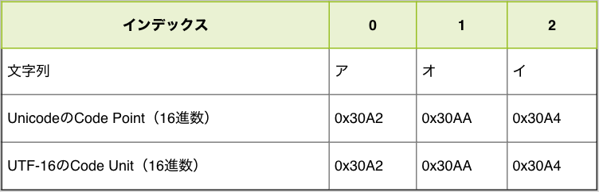

# 文字列とUnicode {#string-unicode}

「[文字列][]」の章で紹介したように、JavaScriptは文字コードとしてUnicodeを採用し、エンコード方式としてUTF-16を採用しています。
このUTF-16を採用しているのは、あくまでJavaScriptの内部で文字列を扱う際の文字コード（内部コード）です。
そのため、コードを書いたファイル自体の文字コード（外部コード）は、UTF-8のようにUTF-16以外の文字コードであっても問題ありません。

「[文字列][]」の章では、これらの文字コードは意識していなかったように、内部的にどのような文字コードで扱っているかは意識せずに文字列処理ができます。
しかし、JavaScriptのStringオブジェクトにはこの文字コード（Unicode）に特化したAPIもあります。
また、絵文字を含む特定の文字を扱う際や「文字数」を数えるという場合には、内部コードであるUTF-16を意識しないといけない場面があります。

この章では、文字列におけるUnicodeを意識しないといけない場面について見ていきます。
また、Unicode自体もECMAScriptと同じように歴史がある仕様であり、Unicodeのすべてを紹介するには膨大な文字列が必要になります。
そのため、この章はJavaScriptにおけるUnicodeとUTF-16に話を限定しています。

Unicodeの歴史を含めた文字コード自体について詳しく知りたい方は「[プログラマのための文字コード技術入門][]」や「[文字コード「超」研究][]」等を参照してください。

## Code Point {#code-point}

Unicodeはすべての文字（制御文字などの画面に表示されない文字も含む）に対してIDを定義する目的で策定されている仕様です。
この「文字」に対する「一意のID」のことを**Code Point**（符号位置）と呼びます。

Code Pointを扱うメソッドの多くは、ECMAScript 2015で追加されています。
ES2015で追加された`String#codePointAt`メソッドや`String.fromCodePoint`メソッドを使うことで、文字列とCode Pointを相互変換できます。

`String#codePointAt`メソッド<sup>[ES2015]</sup>は、文字列の指定インデックスにある文字のCode Pointの値を返します。

{{book.console}}
```js
// 文字列"あ"のCode Pointを取得
console.log("あ".codePointAt(0)); // => 12354
```

一方の`String.fromCodePoint`メソッド<sup>[ES2015]</sup>は、指定したCode Pointに対応する文字を返します。

{{book.console}}
```js
// Code Pointが`12354`の文字を取得する
console.log(String.fromCodePoint(12354)); // => "あ"
// `12354`を16進数リテラルで表記しても同じ結果
console.log(String.fromCodePoint(0x3042)); // => "あ"
```

また、文字列リテラル中にはUnicodeエスケープシーケンスで、直接Code Pointを書くこともできます。
Code Pointは`\u{Code Pointの16進数の値}`のようにエスケープシーケンスとして記述できます。
Unicodeエスケープシーケンスでは、Code Pointの16進数の値が必要となります。
`Number#toString`メソッドの引数に基数となる`16`を渡すことで、16進数の文字列を取得できます。

{{book.console}}
```js
// "あ"のCode Pointは12354
const codePointOfあ = "あ".codePointAt(0);
// 12354の16進数表現は"3042"
const hexOfあ = codePointOfあ.toString(16);
console.log(hexOfあ);// => "3042"
// Unicodeエスケープで"あ"を表現できる
console.log("\u{3042}"); // => "あ"
```

## Code PointとCode Unitの違い {#code-point-is-not-code-unit}

Code Point（符号位置）について紹介しましたが、JavaScriptの文字列の構成要素はUTF-16で変換されたCode Unit（符号単位）です（詳細は「[文字列][]」の章を参照）。
ある範囲の文字列については、Code Point（符号位置）とCode Unit（符号単位）は結果として同じ値となります。

次のコードでは、`アオイ`という文字列の各要素をCode PointとCode Unitとして表示しています。
`convertCodeUnits`関数は文字列をCode Unitの配列にし、`convertCodePoints`関数は文字列をCode Pointの配列にしています。それぞれの関数の実装はまだ理解しなくても問題ありません。

{{book.console}}
```js
// 文字列をCode Unit(16進数)の配列にして返す
function convertCodeUnits(str) {
    const codeUnits = [];
    for (let i = 0; i < str.length; i++) {
        codeUnits.push(str.charCodeAt(i).toString(16));
    }
    return codeUnits;
}
// 文字列をCode Point(16進数)の配列にして返す
function convertCodePoints(str) {
    return Array.from(str).map(char => {
        return char.codePointAt(0).toString(16);
    });
}

const str = "アオイ";
const codeUnits = convertCodeUnits(str);
console.log(codeUnits); // => ["30a2", "30aa", "30a4"]
const codePoints = convertCodePoints(str);
console.log(codePoints); // => ["30a2", "30aa", "30a4"]
```

実行した結果をまとめてみると、この文字列においてはCode PointとCode Unitが同じ値になっていることがわかります。



しかし、文字列によってはCode PointとCode Unitが異なる値となる場合があります。

先ほどと同じ関数を使い、`リンゴ🍎`（リンゴの絵文字）という文字列を構成するCode UnitとCode Pointを見比べてみます。

{{book.console}}
```js
// 文字列をCode Unit(16進数)の配列にして返す
function convertCodeUnits(str) {
    const codeUnits = [];
    for (let i = 0; i < str.length; i++) {
        codeUnits.push(str.charCodeAt(i).toString(16));
    }
    return codeUnits;
}
// 文字列をCode Point(16進数)の配列にして返す
function convertCodePoints(str) {
    return Array.from(str).map(char => {
        return char.codePointAt(0).toString(16);
    });
}

const str = "リンゴ🍎";
const codeUnits = convertCodeUnits(str);
console.log(codeUnits); // => ["30ea", "30f3", "30b4", "d83c", "df4e"]
const codePoints = convertCodePoints(str);
console.log(codePoints); // => ["30ea", "30f3", "30b4", "1f34e"]
```

実行した結果をまとめてみると、この絵文字を含む文字列においてはCode PointとCode Unitが異なる値となることがわかります。


具体的には、Code Pointの要素数が4つなのに対して、Code Unitの要素数が5つになっています。
また、Code Pointでは1つのCode Pointが`🍎`に対応していますが、Code Unitでは2つのCode Unitで`🍎`に対応しています。JavaScriptでは「文字列はCode Unitが順番に並んだもの」として扱われるためこの文字列の要素数（長さ）はCode Unitの個数である5つとなっています。

ある1つの文字に対応するIDであるCode Pointを、16bit（2バイト）のCode Unitで表現するのがUTF-16というエンコード方式です。しかし、16bit（2バイト）で表現できる範囲は、65536種類（2の16乗）です。
現在、Unicodeに登録されているCode Pointは10万種類を超えているため、すべての文字とCode Unitを1対1の関係で表すことができません。

このような場合に、UTF-16では2つCode Unitの組み合わせ（合計4バイト）で1つの文字（1つのCode Point）を表現します。この仕組みを**サロゲートペア**と呼びます。

## サロゲートペア {#surrogate-pair}

サロゲートペアでは、2つCode Unitの組み合わせ（合計4バイト）で1つの文字（1つのCode Point）を表現します。UTF-16では、次の範囲をサロゲートペアに利用する領域としています。

- `\uD800`～`\uDBFF`：上位サロゲートの範囲
- `\uDC00`～`\uDFFF`：下位サロゲートの範囲

文字列中に上位サロゲートと下位サロゲートのCode Unitが並んだ場合に、2つのCode Unitを組み合わせて1文字（Code Point）として扱います。

次のコードでは、サロゲートペアの文字である「𩸽（ほっけ）」を次の2つのCode Unitで表現しています。
Code Unitのエスケープシーケンス（`\uXXXX`）を2つ並べることで`𩸽`という文字を表現できます。
一方で、ES2015からはCode Pointのエスケープシーケンス（`\u{XXXX}`）も書けるため、1つのCode Pointで`𩸽`という文字を表現できることもわかります。しかし、Code Pointのエスケープシーケンスで書いた場合でも、内部的にCode Unitに変換された値で保持されることは変わりません。

{{book.console}}
```js
// 上位サロゲート + 下位サロゲートの組み合わせ
console.log("\uD867\uDE3D"); // => "𩸽"
// Code Pointでの表現
console.log("\u{29e3d}"); // => "𩸽"
```

先ほどの例で登場した`🍎`（リンゴの絵文字）もサロゲートペアで表現される文字です。

{{book.console}}
```js
// Code Unit（上位サロゲート + 下位サロゲート）
console.log("\uD83C\uDF4E"); // => "🍎"
// Code Point
console.log("\u{1F34E}"); // => "🍎"
```

このようにサロゲートペアでは、2つのCode Unitで1つのCode Pointを表現します。

基本的には、文字列はCode Unitが順番に並んでいるものとして扱われるため、多くの`String`のメソッドはCode Unitごとに作用します。
また、インデックスアクセスもCode Unitごととなります。そのため、サロゲートペアで表現している文字列では、上位サロゲート（0番目）と下位サロゲート（1番目）へのインデックスアクセスになります。

{{book.console}}
```js
// 内部的にはCode Unitが並んでいるものとして扱われている
console.log("\uD867\uDE3D"); // => "𩸽"
// インデックスアクセスもCode Unitごととなる
console.log("𩸽"[0]); // => "\uD867"
console.log("𩸽"[1]); // => "\uDE3D"
```

絵文字や「𩸽（ほっけ）」などのサロゲートペアで表現される文字が文字列中に含まれれると、Code Unitごとに扱う文字列処理は複雑になります。

たとえば、`String#length`プロパティは文字列におけるCode Unitの要素数を数えるため、`"🍎".length`の結果は`2`となります。

```js
console.log("🍎".length); // => 2
```

このような場合には、文字列をCode Pointごとに処理することを考える必要があります。

## Code Pointを扱う {#handle-code-point}

文字列をCode Pointが順番に並んだものとして扱うには、Code Pointに対応したメソッドなどを利用する必要があります。

ES2015から文字列をCode Pointごとに扱うメソッドや構文が追加されています。
次に紹介するものは、文字列をCode Pointごとに扱います。

- `CodePoint`を名前に含むメソッド
- `u`（Unicode）フラグが有効化されている正規表現
- 文字列のIteratorを扱うもの（Destructuring、`for...of`、`Array.from`メソッドなど）

これらのCode Pointを扱う処理と具体的な使い方を見ていきます。

### 正規表現の`.`とUnicode {#regexp-unicode}

ES2015では、正規表現に`u`（Unicode）フラグが追加されました。
この`u`フラグをつけた正規表現は、文字列をCode Pointが順番に並んだものとして扱います。

具体的に`u`フラグの有無による`.`（改行文字以外のどの1文字にもマッチする特殊文字）の動作の違いを見ていきます。

`/(.)のひらき/`というパターンで`.`にマッチする部分を取り出すことを例に見ていきます。

まずは、`u`フラグをつけていない正規表現と`String#match`メソッドでマッチした範囲を取り出してみます。`match`メソッドの返す値は`[マッチした全体の文字列, キャプチャされた文字列]`です（詳細は「[文字列][]」の章を参照）。

実際にマッチした結果を見てみると、`.`は`𩸽`の下位サロゲートである`\ude3d`にマッチしていることがわかります（`\ude3d`は単独では表示できないため、文字化けのように表示されます）。

{{book.console}}
```js
const [all, fish] = "𩸽のひらき".match(/(.)のひらき/);
console.log(all); // => "\ude3dのひらき"
console.log(fish); // => "\ude3d"
```

つまり、`u`フラグをつけていない正規表現は、文字列をCode Unitが順番に並んだものとして扱っています。

このような意図しない結果を避けるには、正規表現に`u`フラグをつけます。
`u`フラグがついた正規表現は、文字列をCode Pointごとに扱います。
そのため、任意の1文字にマッチする`.`が`𩸽`という文字（Code Point）にマッチします。

{{book.console}}
```js
const [all, fish] = "𩸽のひらき".match(/(.)のひらき/u);
console.log(all); // => "𩸽のひらき"
console.log(fish); // => "𩸽"
```

基本的には正規表現に`u`フラグをつけて問題となるケースは少ないはずです。
なぜなら、サロゲートペアの片方だけにマッチしたい正規表現を書くケースはまれであるためです。

<!-- TODO: この文いらない可能性高い -->

### Code Pointの数を数える {#count-of-code-points}

`String#length`プロパティは、文字列を構成するCode Unitの個数を表すプロパティです。
そのためサロゲートペアを含む文字列では、`length`の結果が見た目より大きな値となる場合があります。

{{book.console}}
```js
// Code Unitの個数を返す
console.log("🍎".length); // => 2
console.log("\uD83C\uDF4E"); // => "🍎"
console.log("\uD83C\uDF4E".length); // => 2
```

JavaScriptには、文字列におけるCode Pointの個数を数えるメソッドは用意されていません。
これを行うには、文字列をCode Pointごとに区切った配列へ変換して、配列の長さを数えるのが簡潔です。

`Array.from`メソッド<sup>[ES2015]</sup>は、引数にiterableなオブジェクトを受け取り、それを元にした新しい配列を返します。
iterableオブジェクトとは`Symbol.iterator`という特別な名前のメソッドを実装したオブジェクトの総称で、`for...of`文などで反復処理が可能なオブジェクトです（詳細は「[ループと反復処理のfor...of文][]」を参照）。

文字列もiterableオブジェクトであるため、`Array.from`メソッドによって1文字（厳密にはCode Point）ごと区切った配列へと変換できます。先ほども紹介したように、文字列をiterableとして扱う場合はCode Pointごとに処理を行います。

{{book.console}}
```js
// Code Pointごとの配列にする
// Array.fromメソッドはIteratorを配列にする
const codePoints = Array.from("リンゴ🍎");
console.log(codePoints); // => ["リ", "ン", "ゴ", "🍎"]
// Code Pointの個数を数える
console.log(codePoints.length); // => 4
```

しかし、Code Pointの数を数えた場合でも、直感的な結果にならない場合もあります。
なぜなら、Code Pointには制御文字などの視覚的に見えないものも定義されているためです。
そのため、文字として数えたくないものは無視するなど、視覚的な**文字列の長さ**を数えるにはさらなる工夫が必要になります。
残念ながら、ビルトインメソッドにはこれらを簡単に扱う方法は用意されていません。

### Code Pointごとに反復処理をする {#loop-each-code-point}

先ほど紹介した`Array.from`メソッドを使えば、文字列をCode Pointで区切った文字の配列へと変換できます。
配列にすれば、あとは「[ループと反復処理][]」の章で学んだ方法を使って、Code Pointごとに反復処理ができます。

次のコードでは、文字列中に登場する`🍎`の個数を数えています。
`countOfCodePoints`関数は、`Array.from`でCode Pointごとの配列にし、配列を`codePoint`でフィルターした結果できた配列の要素数を返します。

{{book.console}}
```js
// 指定した`codePoint`の個数を数える
function countOfCodePoints(str, codePoint) {
    return Array.from(str).filter(item => {
        return item === codePoint;
    }).length;
}
console.log(countOfCodePoints("🍎🍇🍎🥕🍒", "🍎")); // => 2
```

`for...of`による反復処理も文字列をCode Pointごとに扱えます。
これは、`for...of`文が対象をIteratorとして列挙するためです。

先ほどのコードと同じ`countOfCodePoints`関数を`for...of`を使って実装してみます。

{{book.console}}
```js
// 指定した`codePoint`の個数を数える
function countOfCodePoints(str, codePoint) {
    let count = 0;
    for (const item of str) {
        if (item === codePoint) {
            count++;
        }
    }
    return count;
}
console.log(countOfCodePoints("🍎🍇🍎🥕🍒", "🍎")); // => 2
```

## 終わりに {#conclusion}

この章では、文字列とUnicodeの関係について簡潔に紹介しました。
Unicodeにはこの章で紹介しきれなかった表現もあります。
また、JavaScriptにはUnicodeをキレイに扱うAPIが用意されているとは言い切れない部分もあります。

一方で「[文字列][]」の章で紹介したように、Code UnitやCode Pointを意識しなくても柔軟で強力な文字列処理ができます。
しかし、近年は絵文字を利用するケースが多くなったため、Code Pointを意識したプログラミングが必要となるケースも増えています。

UnicodeはECMAScriptとは独立した仕様であるため、文字列を扱う悩みはプログラミング言語を問わずに出てくる共通の課題です。
特にJavaはJavaScriptと同じくUTF-16をエンコード方式として採用しているため、類似する問題が見られます。
そのため、JavaScriptで文字列処理の問題にぶつかった際には、他の言語ではどうしているかを調べることも重要です。

[文字列]: ../string/README.md
[ループと反復処理]: ../loop/README.md
[ループと反復処理のfor...of文]: ../loop/README.md#for-of-statement

[文字コード「超」研究]: http://www.rutles.net/products/detail.php?product_id=298
[プログラマのための文字コード技術入門]: https://gihyo.jp/book/2019/978-4-297-10291-3
