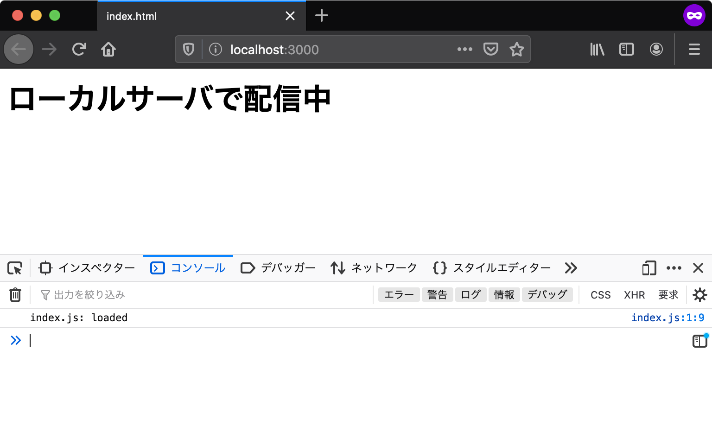

# アプリケーション開発の準備 {#setup-local-env}

これまでに学んだJavaScriptの基本構文は、実行環境を問わずに使えるものです。
しかしこの後に続くユースケースの章では、具体的な実行環境としてウェブブラウザと[Node.js][]の2つを扱います。
また、ブラウザで実行するアプリケーションであっても、その開発にはツールとしてのNode.jsが欠かせません。
このセクションではユースケースの学習へ進むために必要なアプリケーション開発環境の準備を行います。

## Node.jsのインストール {#install-nodejs}

[Node.js][]はサーバーサイドJavaScript実行環境のひとつで、次のような特徴があります。

- ウェブブラウザのChromeと同じ[V8][] JavaScriptエンジンで動作する
- オープンソースで開発されている
- OSを問わずクロスプラットフォームで動作する

Node.jsはサーバーサイドで使うために開発されました。
しかし今ではコマンドラインツールや[Electron][]などのデスクトップアプリケーションにも利用されています。
そのため、Node.jsはサーバーサイドに限らずクライアントサイドのJavaScript実行環境としても幅広く使われています。

Node.jsは多くの他のプログラミング言語と同じように、実行環境をマシンにインストールすることで使用できます。
公式の[ダウンロードページ][]から、開発用のマシンに合わせたインストーラをダウンロードして、インストールしましょう。

Node.jsには**LTS（Long-Term Support）**版と最新版の2つのリリース版があります。
**LTS（Long-Term Support）**版は2年間のメンテナンスとサポートが宣言されたバージョンです。
具体的には、後方互換性を壊さない範囲でのアップデートと、継続的なセキュリティパッチの提供が行われます。
一方で、最新版はNode.jsの最新の機能を使用できますが、常に最新のバージョンしかメンテナンスされません。
ほとんどのユーザーは、LTS版を用いることが推奨されます。Node.jsでの開発が初めてであれば、迷わずにLTS版のインストーラをダウンロードしましょう。
この章では執筆時点の最新LTS版であるバージョン{{book.nodeversion}}で動作するように開発します。

インストールが完了すると、コマンドラインで`node`コマンドが使用可能になっているはずです。
次のコマンドを実行して、インストールされたNode.jsのバージョンを確認しましょう
（`$`はコマンドラインの入力欄を表す記号であるため、実際に入力する必要はありません）。

{{book.triplebackticks}}
$ node -v 
v{{book.nodeversion}}
{{book.triplebackticks}}

また、Node.jsには[npm][]というパッケージマネージャーが同梱されています。
Node.jsをインストールすると、`node`コマンドだけでなくnpmを扱うための`npm`コマンドも使えるようになっています。
次のコマンドを実行して、インストールされたnpmのバージョンを確認しましょう。

{{book.triplebackticks}}
$ npm -v 
{{book.npmversion}}
{{book.triplebackticks}}

npmや`npm`コマンドについての詳細は[公式ドキュメント](https://docs.npmjs.com/)や[npmのGitHubリポジトリ][]を参照してください。
Node.jsのライブラリのほとんどはnpmを使ってインストールできます。
実際に、ユースケースの章ではnpmを使ってライブラリをインストールして利用します。

## npxコマンドによるnpmパッケージの実行 {#npx-execution}

Node.jsを使ったコマンドラインツールは数多く公開されており、npmでインストールすることによりコマンドとして実行できるようになります。
ところで、Node.jsのインストールにより、[npx][]というコマンドも使えるようになっています。
`npx`コマンドを使うと、npmで公開されている実行可能なパッケージのインストールと実行をまとめてできます。
この後のユースケースでも`npx`コマンドでツールを利用するため、ここでツールの実行を試してみましょう。

ここでは例として[@js-primer/hello-world][]というサンプル用のパッケージを実行します。
`npx`コマンドでコマンドラインツールを実行するには、次のように `npx`コマンドにパッケージ名を渡して実行します。

```
$ npx @js-primer/hello-world
npx: 1個のパッケージを7.921秒でインストールしました。
Hello World!
```

このように、`npx`コマンドを使うことによりnpmで公開されているコマンドラインツールを簡単に実行できます。

### [コラム] コマンドラインツールのインストールと実行 {#command-line-tools-installation}

npmで公開されているコマンドラインツールを実行する方法は`npx`コマンドだけではありません。
`npm install`コマンドを使ってパッケージをインストールし、インストールされたパッケージのコマンドを実行する方法があります。
通常の`npm install`コマンドは実行したカレントディレクトリにパッケージをインストールしますが、`--global`フラグを加えるとパッケージをグローバルインストールします。
グローバルインストールされたパッケージのコマンドは、`node`コマンドや`npm`コマンドと同じように、任意の場所から実行できます。

次の例では`@js-primer/hello-world`パッケージをグローバルインストールしています。
その後、パッケージに含まれている`js-primer-hello-world`コマンドを絶対パスの指定なしで呼び出しています。

```
$ npm install --global @js-primer/hello-world
$ js-primer-hello-world
Hello World!
```

## ローカルサーバーのセットアップ {#local-server}

「[値の評価と表示][]」の章では、`index.html`と`index.js`というファイルを作成してブラウザで表示していました。
このときローカルに作成したHTMLファイルをそのままブラウザで読み込むと、ブラウザのアドレスバーは`file:///`からはじまるURLになります。
`file`スキーマでは[Same Origin Policy][]というセキュリティ的な制限により、多くの場面でアプリケーションは正しく動作しません。

これからユースケースの章で書いていくアプリケーションは、[Same Origin Policy][]の制限を避けるために、`http`スキーマのURLでアクセスすることを前提としています。
開発用のローカルサーバーを使うことで、ローカルに作成したHTMLファイルも`http`スキーマのURLで表示できます。

ここでは、これからのユースケースで利用する開発用のローカルサーバーをセットアップする方法を見ていきます。

### HTMLファイルの用意 {#preparing-html}

まずは最低限の要素だけを配置したHTMLファイルを作成しましょう。
ここでは`index.html`というファイル名で作成し、HTMLファイル内には次のように記述しています。
このHTMLファイルでは`script`要素を使って`index.js`というファイル名のJavaScriptファイルを読み込んでいます。

[import title:"index.html"](src/index.html)

同じように`index.js`というファイル名でJavaScriptファイルを作成します。
この`index.js`には、スクリプトが正しく読み込まれたことを確認できるよう、コンソールにログを出力する処理だけを書いておきます。

[import title:"index.js"](src/index.js)

### ローカルサーバーを起動する {#open-js-primer-local-server}

先ほど作成した`index.html`と同じディレクトリで、ローカルサーバーを起動します。
次のコマンドでは、[@js-primer/local-server][]というこの書籍用に作成されたローカルサーバーモジュールをダウンロードと同時に実行します。
このローカルサーバーモジュールは、`http`スキーマのURLでローカルファイルへアクセスできるように、実行したディレクトリにあるファイルを配信する機能を持ちます。

```shell-session
# からはじまる行はコメントなので実行はしなくてよい
# cdコマンドでファイルがあるディレクトリまで移動
$ cd "index.htmlがあるディレクトリのパス"

# npx コマンドでローカルサーバーを起動
$ npx @js-primer/local-server

js-primerのローカルサーバーを起動しました。
次のURLをブラウザで開いてください。

  URL: http://localhost:3000

```
 
<!-- textlint-disable ja-technical-writing/sentence-length -->

起動したローカルサーバーのURL（`http://localhost:3000`）へブラウザでアクセスすると、先ほどの`index.html`の内容が表示されます。
多くのサーバーでは、`http://localhost:3000`のようにファイルパスを指定せずにアクセスすると、`index.html`を配信する機能を持っています。
`@js-primer/local-server`もこの機能を持つため、`http://localhost:3000`と`http://localhost:3000/index.html`のどちらのURLも同じ`index.html`を配信しています。

<!-- textlint-enable ja-technical-writing/sentence-length -->



`index.html`にアクセスできたら、正しく`index.js`が読み込まれているかを確認してみましょう。
Console APIで出力したログを確認するには、ウェブブラウザの開発者ツールを開く必要があります。
ほとんどのブラウザで開発者ツールが同梱されていますが、この書籍ではFirefoxを使って確認します。

Firefoxの開発者ツールは次のいずれかの方法で開きます。

- Firefox メニュー（メニューバーがある場合や macOS では、ツールメニュー）の Web 開発サブメニューで "Web コンソール" を選択する
- キーボードショートカット Ctrl+Shift+K（macOS では Command+Option+K）を押下する

詳細は"[Webコンソールを開く][]"を参照してください。

### ローカルサーバーを終了する {#close-js-primer-local-server}

最後に、起動したローカルサーバーを終了します。
ローカルサーバーを起動したコマンドラインで、`Ctrl+C`を押下することで終了できます。

複数のローカルサーバーを同時に起動することも可能ですが、複数のサーバーで同じポート番号を利用することはできません。
ポートとは、先ほど起動したローカルサーバーのURLで`:3000`となっていた部分のことで、これは3000番ポートでローカルサーバーを起動したことを意味しています。

`@js-primer/local-server`は、デフォルトのポート（3000番ポート）がすでに使用されているなら、使われていないポートを探してローカルサーバーを起動します。また、`--port`オプションで任意のポート番号でローカルサーバーを起動できます。

```
$ npx @js-primer/local-server --port 8000
```

この書籍では、`@js-primer/local-server`をデフォルトのポート番号である3000番ポートを利用する前提で進めていきます。
そのため、使わなくなったローカルサーバーは`Ctrl+C`で終了しておくことで、アクセスするURL（ポート番号）が書籍と同じ状態で進められます。

## まとめ {#conslusion}

この章では、これからのユースケースの章で必要な環境を準備しました。

- Node.jsのLTS版をインストールした
- npmとnpxでモジュールのインストールと実行をした
- `@js-primer/local-server`モジュールを使ってローカルサーバーを起動して終了した

npmでは、すでに多種多様なローカルサーバーモジュールが公開されています。
この書籍では、利用するローカルサーバーの機能で違いが出ないように`@js-primer/local-server`というこの書籍用のローカルサーバーモジュールを利用します。

[Node.js]: https://nodejs.org/ja/
[V8]: https://developers.google.com/v8/
[Electron]: http://electron.atom.io/
[ダウンロードページ]: https://nodejs.org/ja/download/
[npm]: https://www.npmjs.com/
[npmのGitHubリポジトリ]: https://github.com/npm/cli
[npx]: https://blog.npmjs.org/post/162869356040/introducing-npx-an-npm-package-runner
[@js-primer/hello-world]: https://github.com/js-primer/hello-world
[@js-primer/local-server]: https://github.com/js-primer/local-server
[値の評価と表示]: ../../basic/read-eval-print/README.md
[Webコンソールを開く]: https://developer.mozilla.org/ja/docs/Tools/Web_Console/Opening_the_Web_Console
[Same Origin Policy]: https://developer.mozilla.org/ja/docs/Web/Security/Same-origin_policy
