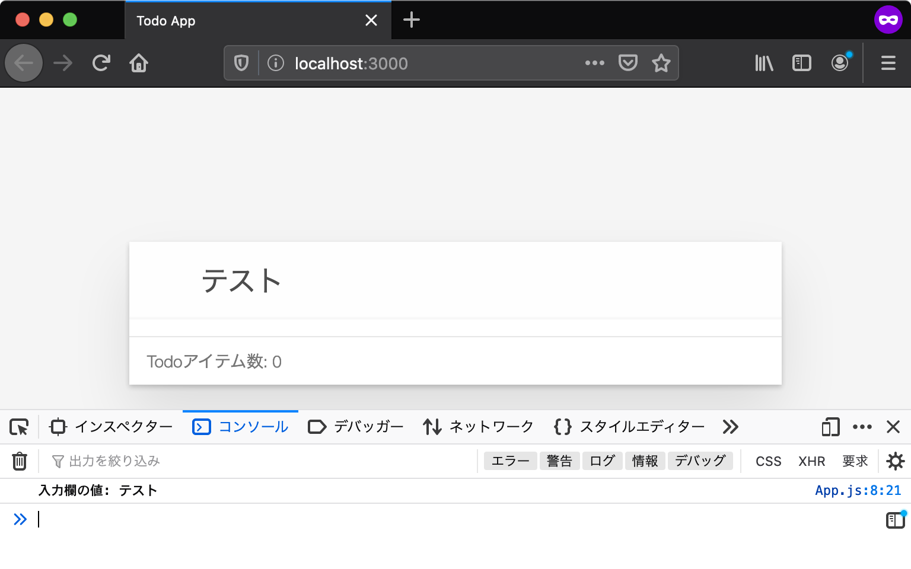

# Todoアイテムの追加を実装する {#form-event}

ここからはJavaScriptでTodoアプリの機能を作成していきます。

このセクションでは、前のセクションでHTMLに目印をつけたTodoリスト（`#js-todo-list`）に対してTodoアイテムを追加する処理を実装します。

## Todoアイテムの追加 {#add-todo-item}

まず、Todoアプリではどのような操作をしたら、Todoアイテムを追加できるかを見ていきます。

Todoアプリでは、ユーザーが次のような操作を行った場合に、Todoアイテムを追加します。

1. 入力欄にTodoアイテムのタイトルを入力する
2. 入力欄でEnterキーを押して送信する
3. TodoリストにTodoアイテムが追加される

これをJavaScriptで実現するには次のことが必要です。

- Todoアイテムのタイトルを取得するために、input要素（入力欄）から内容を取得する
- Enterキーで送信されたことを知るために、form要素の`submit`イベント（送信）を監視する
- 入力内容をタイトルにしたTodoアイテムを作成し、Todoリスト（`#js-todo-list`）にTodoアイテム要素を追加する

まずは、form要素から送信されたイベントを受け取り、入力内容をコンソールログに表示してみることからはじめてみましょう。

## 入力内容をコンソールに表示する {#input-to-console}

form要素でEnterキーを押して送信すると`submit`イベントが発生します。
この`submit`イベントはHTML要素の`addEventListener`メソッドを利用することで受け取れます。

次のコードでは、指定したform要素から`submit`イベントが発生したときに呼び出されるコールバック関数を登録しています。

<!-- doctest:disable -->
```js
// `id="js-form`の要素を取得
const formElement = document.querySelector("#js-form");
// form要素から発生したsubmitイベントを受け取る
formElement.addEventListener("submit", (event) => {
    // イベントが発生したときに呼ばれるコールバック関数（イベントリスナー）
});
```

<!-- textlint-disable prh -->

このようなイベントが発生した際に呼ばれるコールバック関数のことを**イベントリスナー**（イベントをリッスンするものという意味）と呼びます。
またイベントリスナーはイベントハンドラーとも呼ばれることがありますが、この書籍ではこの2つの言葉は同じ意味として扱います。

<!-- textlint-enable prh -->

フォームが送信されたときに入力内容をコンソールに表示するには、
`addEventListener`コールバック関数内で入力内容をConsole APIで出力すればよいことになります。

入力内容はinput要素の`value`プロパティから取得できます。

<!-- doctest:disable -->
```js
const inputElement = document.querySelector("#js-form-input");
console.log(inputElement.value); // => "input要素の入力内容"
```

これらを組み合わせて`App.js`に「入力内容をコンソールに表示」する機能を実装してみましょう。
`App`クラスに`mount`というメソッドを定義して、その中に処理を書いていきましょう。

次のコードでは、フォーム（`#js-form`）をEnterで送信すると、input要素（`#js-form-input`）の内容をコンソールへ表示する処理を実装しています。

[import, title:"src/App.js"](./prevent-event/src/App.js)

このままでは、`App#mount`は呼び出されないため何も行われません。
そのため、`index.js`も変更して、`App`クラスの`mount`メソッドを呼び出すようにします。

[import, title:"index.js"](./prevent-event/index.js)

これらの変更後にブラウザでページをリロードすると、`App#mount`メソッドが実行されるようになります。
`submit`イベントがリッスンされているので、入力欄に何か入力してEnterで送信してみるとその内容がコンソールに表示されます。



先ほどの`App#mount`メソッドでは、`submit`イベントのイベントリスナー内で`event.preventDefault`メソッドを呼び出しています。
`event.preventDefault`メソッドは、`submit`イベントの発生元であるフォームが持つデフォルトの動作をキャンセルするメソッドです。

フォームが持つデフォルトの動作とは、フォームの内容を指定したURLへ送信するという動作です。
ここでは`form`要素に送信先が指定されていないため、現在のURLに対してフォームの内容を送信します。
しかしこの動作は邪魔になるため、`event.preventDefault`メソッドを呼び出すことで、このデフォルトの動作をキャンセルしています。

<div class="code-filename-block"><p class="code-filename">src/App.jsより抜粋</p></div>

<!-- doctest:disable -->
```js
formElement.addEventListener("submit", (event) => {
    // submitイベントの本来の動作を止める
    event.preventDefault();
    console.log(`入力欄の値: ${inputElement.value}`);
});
```

<!-- textlint-disable no-js-function-paren -->

現在のURLに対してフォームの送信が行われると、結果的にページがリロードされてしまいます。
そのため、`event.preventDefault()`を呼び出し、デフォルトの動作をキャンセルしていました。
`event.preventDefault()`をコメントアウトすると、ページがリロードされてしまうことが確認できます。

<!-- textlint-enable no-js-function-paren -->

<div class="code-filename-block"><p class="code-filename">src/App.jsから一部をコメントアウトした例</p></div>

<!-- doctest:disable -->
```js
formElement.addEventListener("submit", (event) => {
    // preventDefaultしないとページがリロードされてしまう
    // event.preventDefault();
    console.log(`入力欄の値: ${inputElement.value}`);
});
```

ここまでで`todoapp`ディレクトリに、次のような変更を加えました。

```
todoapp
├── index.html
├── index.js (App#mountの呼び出し)
└── src
    └── App.js (App#mountの実装)
```


ここまでのTodoアプリは次のURLで確認できます。

- <https://jsprimer.net/use-case/todoapp/form-event/prevent-event/>

## 入力内容をTodoリストに表示する {#input-to-todolist}

フォーム送信時に入力内容を取得する方法がわかったので、次はその入力内容をTodoリスト（`#js-todo-list`）に表示します。

HTMLではリストのアイテムを記述する際には`<li>`タグを使います。
また後ほどTodoリストに表示するTodoアイテムの要素には、完了状態を表すチェックボックスや削除ボタンなども含めたいです。
これらの要素を含むものを手続き的にDOM APIで作成すると見通しが悪くなるため、HTML文字列からHTML要素を生成するユーティリティモジュールを作成しましょう。

次の`html-util.js`というファイルを`src/view/html-util.js`というパスに作成します。

この`html-util.js`は「[ajaxapp: HTML文字列をDOMに追加する][]」でも利用した`escapeSpecialChars`をベースにしています。
ajaxappでの`escapeHTML`タグ関数では出力は**HTML文字列**でしたが、今回作成する`element`タグ関数の出力は**HTML要素**（Element）です。

Todoリスト（`#js-todo-list`）というすでに存在する要素に対して要素を**追加**するには、HTML文字列ではなくHTML要素が必要になります。
また、HTML文字列に対しては`addEventListener`でイベントをリッスンできません。
そのため、チェックボックスの状態が変わったことや削除ボタンが押されたことを知る必要があるTodoアプリではHTML要素が必要になります。

[import, title:"src/view/html-util.js"](./add-todo-item/src/view/html-util.js)

`element`タグ関数では、同じファイルに定義した`htmlToElement`関数を使ってHTML文字列からHTML要素を作成しています。
`htmlToElement`関数の中で利用している[template要素][]はHTML5で追加された、HTML文字列の断片からHTML要素を作成できる要素です。

この`element`タグ関数を使うことで、次のようにHTML文字列からHTML要素を作成できます。
作成した要素は、`appendChild`メソッドなどで既存の要素に子要素として追加できます。

<div class="code-filename-block"><p class="code-filename">elementタグ関数のサンプルコード</p></div>

<!-- doctest:disable -->
```js
// HTML文字列からHTML要素を作成
const newElement = element`<ul>
    <li>新しい要素</li>
</ul>`;
// 作成した要素を`document.body`の子要素として追加（appendChild）する
document.body.appendChild(newElement);
```

ブラウザが提供する`appendChild`メソッドは子要素を追加するだけなので、すでに別の要素がある場合は末尾に追加されます。

このセクションではまだ利用しませんが、`html-util.js`には`render`という関数を定義しています。
`render`関数は指定したコンテナ要素（親となる要素）の子要素を上書きする関数となります。
動作的には一度子要素をすべて消したあとに`appendChild`で子要素として追加しています。

<div class="code-filename-block"><p class="code-filename">render関数のサンプルコード</p></div>

<!-- doctest:disable -->
```js
// `ul`要素の空タグを作成
const newElement = element`<ul />`;
// `newElement`を`document.body`の子要素として追加する
// すでに`document.body`以下に要素がある場合は上書きされる
render(newElement, document.body);
```

最後に、この`element`タグ関数を使って、フォームから送信された入力内容をTodoリストに要素として追加してみます。

`App.js`から先ほど作成した`html-util.js`の`element`タグ関数を`import`します。
次に`submit`イベントのリスナー関数で、Todoアイテムを表現する要素を作成し、Todoリスト（`#js-todo-list`）の子要素として追加（`appendChild`）します。
最後にTodoアイテム数（`#js-todo-count`）のテキスト（`textContent`）を更新します。

[import, title:"src/App.js"](./add-todo-item/src/App.js)

これらの変更後にブラウザでページをリロードし、フォームに入力してからEnterを押すとTodoリストに**Todoアイテムが追加**されます。
また、入力内容を送信するたびに`todoItemCount`が加算され、**Todoアイテム数**の表示も更新されます。


このセクションでの変更点は次のとおりです。

```
todoapp
├── index.html
├── index.js
└── src
    ├── App.js(Todoアイテムの表示の実装)
    └── view
        └── html-util.js(新規追加)
```

ここまでのTodoアプリは次のURLで確認できます。

- <https://jsprimer.net/use-case/todoapp/form-event/add-todo-item/>

## まとめ {#conclusion}

このセクションではform要素の`submit`イベントをリッスンし、入力内容を元にTodoアイテムを作成し、これをTodoリストに追加する機能を実装しました。
今回のTodoアイテムの追加のように、多くのウェブアプリは何らかのイベントをリッスンして表示を更新します。
このような、イベントが発生したことを元に処理を進める方法を**イベント駆動**（イベントドリブン）と呼びます。

今回のTodoアイテムの追加では、`submit`イベントを入力にして、Todoリスト要素を**直接HTML要素として追加**するという方法を取っていました。
<!-- textlint-disable -->
このように直接DOMを更新するという方法はコードが短くなりますが、DOMのみにしか状態が残らないため柔軟性がなくなるという問題があります。
<!-- textlint-enable -->
次のセクションでは、実際に起きる問題やそれを解決するための仕組みを見ていきます。

## このセクションのチェックリスト {#section-checklist}

- フォームの送信を`submit`イベントで受け取り、入力内容を確認した
- HTML文字列からHTML要素を作成する`html-util.js`を実装した
- フォームからTodoアイテムを追加した
- Todoアイテムの追加に合わせてTodoアイテム数を更新した

このセクションで、TodoアプリにTodoアイテムを追加する機能が実装できました。

- Todoアイテムを追加できる

Todoアプリに実装する残りの機能は次のとおりです。

- Todoアイテムの完了状態を更新できる
- Todoアイテムを削除できる

[ajaxapp: HTML文字列をDOMに追加する]: ../../ajaxapp/display/README.md#html-to-dom
[template要素]: https://developer.mozilla.org/ja/docs/Web/HTML/Element/template
