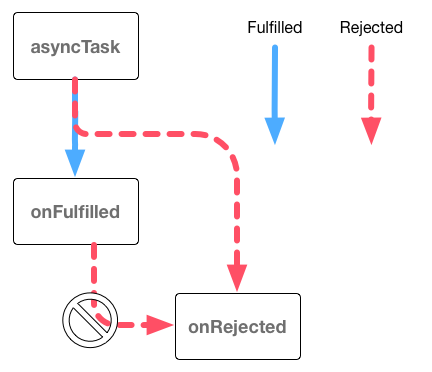

# 非同期処理:コールバック/Promise/Async Function {#async-handling}

この章ではJavaScriptの非同期処理について学んでいきます。
非同期処理はJavaScriptにおけるとても重要な概念です。
また、JavaScriptを扱うブラウザやNode.jsなどのAPIには非同期処理のみのものも多いため、非同期処理を避けることはできません。
そのため、非同期処理を扱うためのエラーファーストコールバックやPromiseというビルトインオブジェクト、さらにはAsync Functionと呼ばれる構文的なサポートがあります。

この章では非同期処理とはどのようなものかという話から、非同期処理での例外処理、非同期処理の扱い方を見ていきます。

## 同期処理 {#sync-processing}

多くのプログラミング言語にはコードの評価の仕方として、**同期処理**（sync）と**非同期処理**（async）という大きな分類があります。

今まで書いていたコードは**同期処理**と呼ばれているものです。
同期処理ではコードを順番に処理していき、ひとつの処理が終わるまで次の処理は行いません。
同期処理では実行している処理はひとつだけとなるため、とても直感的な動作となります。

一方、同期的にブロックする処理が行われていた場合には問題があります。
同期処理ではひとつの処理が終わるまで、次の処理へ進むことができないためです。

次のコードの`blockTime`関数は指定した`timeout`ミリ秒だけ無限ループを実行し、同期的にブロックする処理です。
この`blockTime`関数を呼び出すと、指定時間が経過するまで次の処理（次の行）は呼ばれません。

{{book.console}}
```js
// 指定した`timeout`ミリ秒経過するまで同期的にブロックする関数
function blockTime(timeout) { 
    const startTime = Date.now();
    // `timeout`ミリ秒経過するまで無限ループをする
    while (true) {
        const diffTime = Date.now() - startTime;
        if (diffTime >= timeout) {
            return; // 指定時間経過したら関数の実行を終了
        }
    }
}
console.log("処理を開始");
blockTime(1000); // 他の処理を1000ミリ秒（1秒間）ブロックする
console.log("この行が呼ばれるまで処理が1秒間ブロックされる");
```

同期的にブロックする処理があると、ブラウザでは大きな問題となります。
なぜなら、JavaScriptは基本的にブラウザのメインスレッド（UIスレッドとも呼ばれる）で実行されるためです。
メインスレッドは表示の更新といったUIに関する処理も行っています。
そのため、メインスレッドが他の処理で専有されると、表示が更新されなくなりフリーズしたようになります。

先ほどの例では1秒間も処理をブロックしているため、1秒間スクロールなどの操作が効かないといった悪影響がでます。

## 非同期処理 {#async-processing}

非同期処理はコードを順番に処理していきますが、ひとつの非同期処理が終わるのを待たずに次の処理を評価します。
つまり、非同期処理では同時に実行している処理が複数あります。

JavaScriptにおいて非同期処理の代表的な関数として`setTimeout`関数があります。
`setTimeout`関数は`delay`ミリ秒後に、`コールバック関数`を呼び出すようにタイマーへ登録する非同期処理です。

<!-- doctest:disable -->
```js
setTimeout(コールバック関数, delay);
```

次のコードでは`setTimeout`関数を使って10ミリ秒後に、1秒間ブロックする処理を実行しています。
`setTimeout`関数でタイマーに登録したコールバック関数は非同期的なタイミングで呼ばれます。
そのため`setTimeout`関数の次の行に書かれている同期的処理は、非同期処理よりも先に実行されます。

{{book.console}}
```js
// 指定した`timeout`ミリ秒経過するまで同期的にブロックする関数
function blockTime(timeout) { 
    const startTime = Date.now();
    while (true) {
        const diffTime = Date.now() - startTime;
        if (diffTime >= timeout) {
            return; // 指定時間経過したら関数の実行を終了
        }
    }
}

console.log("1. setTimeoutのコールバック関数を10ミリ秒後に実行します");
setTimeout(() => {
    console.log("3. ブロックする処理を開始します");
    blockTime(1000); // 他の処理を1秒間ブロックする
    console.log("4. ブロックする処理が完了しました");
}, 10);
// ブロックする処理は非同期なタイミングで呼び出されるので、次の行が先に実行される
console.log("2. 同期的な処理を実行します");
```

このコードを実行した結果のコンソールログは次のようになります。

<!-- textlint-disable preset-ja-technical-writing/ja-no-redundant-expression -->

1. setTimeoutのコールバック関数を10ミリ秒後に実行します
2. 同期的な処理を実行します
3. ブロックする処理を開始します
4. ブロックする処理が完了しました

<!-- textlint-enable preset-ja-technical-writing/ja-no-redundant-expression -->

このように、非同期処理（`setTimeout`のコールバック関数）は、コードの見た目上の並びとは異なる順番で実行されることがわかります。

## 非同期処理はメインスレッドで実行される {#async-and-main-thread}

JavaScriptにおいて多くの非同期処理はメインスレッドで実行されます。
メインスレッドはUIスレッドとも呼ばれ、重たいJavaScriptの処理はメインスレッドで実行する他の処理（画面の更新など）をブロックする問題について紹介しました（ECMAScriptの仕様として規定されているわけではないため、すべてがメインスレッドで実行されているわけではありません）。

非同期処理は名前から考えるとメインスレッド以外で実行されるように見えますが、
基本的には非同期処理も同期処理と同じようにメインスレッドで実行されます。
このセクションでは非同期処理がどのようにメインスレッドで実行されているかを簡潔に見ていきます。

次のコードは、`setTimeout`関数でタイマーに登録したコールバック関数が呼ばれるまで、実際にどの程度の時間がかかったかを計測しています。
また、`setTimeout`関数でタイマーに登録した次の行で、同期的にブロックする処理を実行しています。

非同期処理（コールバック関数）がメインスレッド以外のスレッドで実行されるならば、
この非同期処理はメインスレッドで同期的にブロックする処理の影響を受けないはずです。
しかし、実際にはこの非同期処理もメインスレッドで実行された同期的にブロックする処理の影響を受けます。

次のコードを実行すると`setTimeout`関数で登録したコールバック関数は、タイマーに登録した時間（10ミリ秒後）よりも大きく遅れて呼び出されます。

{{book.console}}
```js
// 指定した`timeout`ミリ秒経過するまで同期的にブロックする関数
function blockTime(timeout) { 
    const startTime = Date.now();
    while (true) {
        const diffTime = Date.now() - startTime;
        if (diffTime >= timeout) {
            return; // 指定時間経過したら関数の実行を終了
        }
    }
}

const startTime = Date.now();
// 10ミリ秒後にコールバック関数を呼び出すようにタイマーに登録する
setTimeout(() => {
    const endTime = Date.now();
    console.log(`非同期処理のコールバックが呼ばれるまで${endTime - startTime}ミリ秒かかりました`);
}, 10);
console.log("ブロックする処理を開始します");
blockTime(1000); // 1秒間処理をブロックする
console.log("ブロックする処理が完了しました");
```

多くの環境では、このときの非同期処理のコールバックが呼ばれるまでは1000ミリ秒以上かかります。
このように**非同期処理**も**同期処理**の影響を受けることから、同じスレッドで実行されていることがわかります。

JavaScriptでは一部の例外を除き非同期処理が**並行処理（concurrent）**として扱われます。
並行処理とは、処理を一定の単位ごとに分けて処理を切り替えながら実行することです。
そのため非同期処理の実行中にとても重たい処理があると、非同期処理の切り替えが遅れるという現象を引き起こします。

このようにJavaScriptの非同期処理も基本的には1つのメインスレッドで処理されています。
これは`setTimeout`関数のコールバック関数から外側のスコープのデータへのアクセス方法に制限がないことからもわかります。
もし非同期処理が別スレッドで行われるならば、自由なデータへのアクセスは競合状態（レースコンディション）を引き起こしてしまうためです。

ただし、非同期処理の中にもメインスレッドとは別のスレッドで実行できるAPIが実行環境によっては存在します。
たとえばブラウザでは[Web Worker][] APIを使い、メインスレッド以外でJavaScriptを実行できます。
このWeb Workerにおける非同期処理は**並列処理（Parallel）**です。
並列処理とは、排他的に複数の処理を同時に実行することです。

Web Workerではメインスレッドとは異なるWorkerスレッドで実行されるため、メインスレッドはWorkerスレッドの同期的にブロックする処理の影響を受けにくくなります。
ただし、Web Workerとメインスレッドでのデータのやり取りには`postMessage`というメソッドを利用する必要があります。
そのため、`setTimeout`関数のコールバック関数とは異なりデータへのアクセス方法にも制限がつきます。

非同期処理のすべてをひとくくりにはできませんが、基本的な非同期処理（タイマーなど）はメインスレッドで実行されているという性質を知ることは大切です。JavaScriptの大部分の**非同期処理**は**非同期的なタイミングで実行される処理**であると理解しておく必要があります。

## 非同期処理と例外処理 {#async-processing-and-error-handling}

非同期処理は処理の流れが同期処理とは異なることについて紹介しました。
これは非同期処理における**例外処理**においても大きな影響を与えます。

<!-- textlint-disable -->
同期処理では、`try...catch`構文を使うことで同期的に発生した例外がキャッチできます（詳細は「[例外処理][]」の章を参照）。
<!-- textlint-enable -->

{{book.console}}
```js
try {
    throw new Error("同期的なエラー");
} catch (error) {
    console.log("同期的なエラーをキャッチできる");
}
console.log("この行は実行されます");
```

非同期処理では、`try...catch`構文を使っても非同期的に発生した例外をキャッチできません。
次のコードでは、10ミリ秒後に非同期的なエラーを発生させています。
しかし、`try...catch`構文では次のような非同期エラーをキャッチできません。

{{book.console}}
<!-- doctest:disable -->
```js
try {
    setTimeout(() => {
        throw new Error("非同期的なエラー");
    }, 10);
} catch (error) {
    // 非同期エラーはキャッチできないため、この行は実行されません
}
console.log("この行は実行されます");
```

`try`ブロックはそのブロック内で発生した例外をキャッチする構文です。
しかし、`setTimeout`関数で登録されたコールバック関数が実際に実行されて例外を投げるのは、すべての同期処理が終わった後となります。
つまり、`try`ブロックで例外が発生しうるとマークした**範囲外**で例外が発生します。

そのため、`setTimeout`関数のコールバック関数における例外は、次のようにコールバック関数内で同期的なエラーとしてキャッチする必要があります。

{{book.console}}
<!-- doctest:disable -->
```js
// 非同期処理の外
setTimeout(() => {
    // 非同期処理の中
    try {
        throw new Error("エラー");
    } catch (error) {
        console.log("エラーをキャッチできる");
    }
}, 10);
console.log("この行は実行されます");
```

このようにコールバック関数内でエラーをキャッチできますが、**非同期処理の外**からは**非同期処理の中**で例外が発生したかがわかりません。
非同期処理の外から例外が起きたことを知るためには、非同期処理の中で例外が発生したことを非同期処理の外へ伝える方法が必要です。

この非同期処理で発生した例外の扱い方についてはさまざまなパターンがあります。
この章では主要な非同期処理と例外の扱い方としてエラーファーストコールバック、Promise、Async Functionの3つを見ていきます。
現実のコードではすべてのパターンが使われています。そのため、非同期処理の選択肢を増やす意味でもそれぞれを理解することが重要です。

## エラーファーストコールバック {#error-first-callback}

ECMAScript 2015（ES2015）でPromiseが仕様に入るまで、非同期処理中に発生した例外を扱う仕様はありませんでした。
このため、ES2015より前までは、**エラーファーストコールバック**という非同期処理中に発生した例外を扱う方法を決めたルールが広く使われていました。

エラーファーストコールバックとは、次のような非同期処理におけるコールバック関数の呼び出し方を決めたルールです。

- 処理が失敗した場合は、コールバック関数の1番目の引数にエラーオブジェクトを渡して呼び出す
- 処理が成功した場合は、コールバック関数の1番目の引数には`null`を渡し、2番目以降の引数に成功時の結果を渡して呼び出す

つまり、ひとつのコールバック関数で失敗した場合と成功した場合の両方を扱うルールとなります。

たとえば、Node.jsでは`fs.readFile`関数というファイルシステムからファイルをロードする非同期処理の関数があります。
指定したパスのファイルを読むため、ファイルが存在しない場合やアクセス権限の問題から読み取りに失敗することがあります。
そのため、`fs.readFile`関数の第2引数に渡すコールバック関数にはエラーファーストコールバックスタイルの関数を渡します。

ファイルを読み込むことに失敗した場合は、コールバック関数の1番目の引数に`Error`オブジェクトが渡されます。
ファイルを読み込むことに成功した場合は、コールバック関数の1番目の引数に`null`、2番目の引数に読み込んだデータを渡します。

<!-- doctest:disable -->
```js
fs.readFile("./example.txt", (error, data) => {
    if (error) {
        // 読み込み中にエラーが発生しました
    } else {
        // データを読み込むことができました
    }
});
```

このエラーファーストコールバックはNode.jsでは広く使われ、Node.jsの標準APIでも利用されています。
詳しい扱い方については「[ユースケース: Node.jsでCLIアプリケーション][]」の章にて紹介します。

実際にエラーファーストコールバックで非同期な例外処理を扱うコードを書いてみましょう。

次のコードの`dummyFetch`関数は、疑似的なリソースの取得をする非同期な処理です。
第1引数に任意のパスを受け取り、第2引数にエラーファーストコールバックスタイルの関数を受け取ります。

この`dummyFetch`関数は、任意のパスにマッチするリソースがある場合には、第2引数のコールバック関数に`null`とレスポンスオブジェクトを渡して呼び出します。
一方、任意のパスにマッチするリソースがない場合には、第2引数のコールバック関数にエラーオブジェクトを渡して呼び出します。

{{book.console}}
```js
/**
 * 1000ミリ秒未満のランダムなタイミングでレスポンスを疑似的にデータ取得する関数
 * 指定した`path`にデータがある場合は`callback(null, レスポンス)`を呼ぶ
 * 指定した`path`にデータがない場合は`callback(エラー)`を呼ぶ
 */
function dummyFetch(path, callback) {
    setTimeout(() => {
        // /success からはじまるパスにはリソースがあるという設定
        if (path.startsWith("/success")) {
            callback(null, { body: `Response body of ${path}` });
        } else {
            callback(new Error("NOT FOUND"));
        }
    }, 1000 * Math.random());
}
// /success/data にリソースが存在するので、`response`にはデータが入る
dummyFetch("/success/data", (error, response) => {
    if (error) {
        // この行は実行されません
    } else {
        console.log(response); // => { body: "Response body of /success/data" }
    }
});
// /failure/data にリソースは存在しないので、`error`にはエラーオブジェクトが入る
dummyFetch("/failure/data", (error, response) => {
    if (error) {
        console.log(error.message); // => "NOT FOUND"
    } else {
        // この行は実行されません
    }
});
```

このようにコールバック関数の1番目の引数にはエラーオブジェクトまたは`null`を入れ、それ以降の引数にデータを渡すというルールを**エラーファーストコールバック**と呼びます。

非同期処理中に例外が発生して生じたエラーをコールバック関数で受け取る方法はほかにもあります。
たとえば、成功したときに呼び出すコールバック関数と失敗したときに呼び出すコールバック関数の2つを受け取る方法があります。
先ほどの`dummyFetch`関数を2種類のコールバック関数を受け取る形に変更すると次のような実装になります。

<!-- doctest:disable -->
```js
/**
 * リソースの取得に成功した場合は`successCallback(レスポンス)`を呼び出す
 * リソースの取得に失敗した場合は`failureCallback(エラー)`を呼び出す
 */
function dummyFetch(path, successCallback, failureCallback) {
    setTimeout(() => {
        if (path.startsWith("/success")) {
            successCallback({ body: `Response body of ${path}` });
        } else {
            failureCallback(new Error("NOT FOUND"));
        }
    }, 1000 * Math.random());
}
```

このように**非同期処理の中**で例外が発生した場合に、その例外を**非同期処理の外**へ伝える方法にはさまざまな手段が考えられます。
エラーファーストコールバックはその形を決めた**共通のルール**の1つです。
ルールを決めることのメリットとして、エラーハンドリングのパターン化ができます。

しかし、エラーファーストコールバックは非同期処理におけるエラーハンドリングの書き方を決めた**ただのルール**であって仕様ではありません。
そのため、エラーファーストコールバックというルールを破っても、問題があるわけではありません。

しかしながら、最初に書いたようにJavaScriptでは非同期処理を扱うケースが多いため、ただのルールではなくECMAScriptの仕様として非同期処理を扱う方法が求められていました。
そこで、ES2015では`Promise`という非同期処理を扱うビルトインオブジェクトが導入されました。

次のセクションでは、ES2015で導入された`Promise`について見ていきます。

## [ES2015] Promise {#promise}

[Promise][]はES2015で導入された非同期処理の結果を表現するビルトインオブジェクトです。

エラーファーストコールバックは非同期処理を扱うコールバック関数の最初の引数にエラーオブジェクトを渡すというルールでした。
`Promise`はこれを発展させたもので、単なるルールではなくオブジェクトという形にして非同期処理を統一的なインターフェースで扱うことを目的にしています。

`Promise`はビルトインオブジェクトであるためさまざまなメソッドを持ちますが、
まずはエラーファーストコールバックと`Promise`での非同期処理のコード例を比較してみます。

次のコードの`asyncTask`関数はエラーファーストコールバックを受け取る非同期処理の例です。

エラーファーストコールバックは次のようなルールでした。

- 非同期処理が成功した場合は、1番目の引数に`null`を渡し2番目以降の引数に結果を渡す
- 非同期処理が失敗した場合は、1番目の引数にエラーオブジェクトを渡す

<!-- doctest:disable -->
```js
// asyncTask関数はエラーファーストコールバックを受け取る
asyncTask((error, result) => {
    if (error) {
        // 非同期処理が失敗したときの処理
    } else {
        // 非同期処理が成功したときの処理
    }
});
```

次のコードの`asyncPromiseTask`関数は`Promise`インスタンスを返す非同期処理の例です。
Promiseでは、非同期処理に成功したときの処理をコールバック関数として`then`メソッドへ渡し、
失敗したときの処理を同じくコールバック関数として`catch`メソッドへ渡します。

エラーファーストコールバックとは異なり、非同期処理（`asyncPromiseTask`関数）は`Promise`インスタンスを返しています。
その返された`Promise`インスタンスに対して、成功と失敗時の処理をそれぞれコールバック関数として渡すという形になります。

<!-- doctest:disable -->
```js
// asyncPromiseTask関数はPromiseインスタンスを返す
asyncPromiseTask().then(()=> {
    // 非同期処理が成功したときの処理
}).catch(() => {
    // 非同期処理が失敗したときの処理
});
```

`Promise`インスタンスのメソッドによって引数に渡せるものが決められているため、非同期処理の流れも一定のやり方に統一されます。
また非同期処理（`asyncPromiseTask`関数）はコールバック関数を受け取るのではなく、`Promise`インスタンスを返すという形に変わっています。
この`Promise`という統一されたインターフェースがあることで、 さまざまな非同期処理のパターンを形成できます。

つまり、複雑な非同期処理をうまくパターン化できるというのが`Promise`の役割であり、 Promiseを使う理由のひとつであると言えるでしょう。
このセクションでは、非同期処理を扱うビルトインオブジェクトである`Promise`を見ていきます。

### `Promise`インスタンスの作成 {#promise-instance}

Promiseは`new`演算子で`Promise`のインスタンスを作成して利用します。
このときのコンストラクタには`resolve`と`reject`の2つの引数を取る`executor`と呼ばれる関数を渡します。
`executor`関数の中で非同期処理を行い、非同期処理が成功した場合は`resolve`関数を呼び、失敗した場合は`reject`関数を呼び出します。

{{book.console}}
```js
const executor = (resolve, reject) => {
    // 非同期の処理が成功したときはresolveを呼ぶ
    // 非同期の処理が失敗したときはrejectを呼ぶ
};
const promise = new Promise(executor);
```

この`Promise`インスタンスの`Promise#then`メソッドで、Promiseが`resolve`（成功）、`reject`（失敗）したときに呼ばれるコールバック関数を登録します。
`then`メソッドの第一引数には`resolve`（成功）時に呼ばれるコールバック関数、第二引数には`reject`（失敗）時に呼ばれるコールバック関数を渡します。

{{book.console}}
```js
// `Promise`インスタンスを作成
const promise = new Promise((resolve, reject) => {
    // 非同期の処理が成功したときはresolve()を呼ぶ
    // 非同期の処理が失敗したときにはreject()を呼ぶ
});
const onFulfilled = () => {
    console.log("resolveされたときに呼ばれる");
};
const onRejected = () => {
    console.log("rejectされたときに呼ばれる");
};
// `then`メソッドで成功時と失敗時に呼ばれるコールバック関数を登録
promise.then(onFulfilled, onRejected);
```

`Promise`コンストラクタの`resolve`と`reject`、`then`メソッドの`onFulfilled`と`onRejected`は次のような関係となります。

- `resolve`（成功）したとき
    - `onFulfilled`が呼ばれる
- `reject`（失敗）したとき
    - `onRejected` が呼ばれる

### `Promise#then`と`Promise#catch` {#promise-then-and-catch}

`Promise`のようにコンストラクタに関数を渡すパターンは今までなかったので、`then`メソッドの使い方について具体的な例を紹介します。
また、`then`メソッドのエイリアスでもある`catch`メソッドについても見ていきます。

次のコードの`dummyFetch`関数は`Promise`のインスタンスを作成して返します。
`dummyFetch`関数はリソースの取得に成功した場合は`resolve`関数を呼び、失敗した場合は`reject`関数を呼びます。

`resolve`に渡した値は、`then`メソッドの1番目のコールバック関数（`onFulfilled`）に渡されます。
`reject`に渡したエラーオブジェクトは、`then`メソッドの2番目のコールバック関数（`onRejected`）に渡されます。

{{book.console}}
```js
/**
 * 1000ミリ秒未満のランダムなタイミングでレスポンスを疑似的にデータ取得する関数
 * 指定した`path`にデータがある場合、成功として**Resolved**状態のPromiseオブジェクトを返す
 * 指定した`path`にデータがない場合、失敗として**Rejected**状態のPromiseオブジェクトを返す
 */
function dummyFetch(path) {
    return new Promise((resolve, reject) => {
        setTimeout(() => {
            if (path.startsWith("/success")) {
                resolve({ body: `Response body of ${path}` });
            } else {
                reject(new Error("NOT FOUND"));
            }
        }, 1000 * Math.random());
    });
}
// `then`メソッドで成功時と失敗時に呼ばれるコールバック関数を登録
// /success/data のリソースは存在するので成功しonFulfilledが呼ばれる
dummyFetch("/success/data").then(function onFulfilled(response) {
    console.log(response); // => { body: "Response body of /success/data" }
}, function onRejected(error) {
    // この行は実行されません
});
// /failure/data のリソースは存在しないのでonRejectedが呼ばれる
dummyFetch("/failure/data").then(function onFulfilled(response) {
    // この行は実行されません
}, function onRejected(error) {
    console.log(error); // Error: "NOT FOUND"
});
```

`Promise#then`メソッドは成功（`onFulfilled`）と失敗（`onRejected`）のコールバック関数の2つを受け取りますが、どちらの引数も省略できます。

次のコードの`delay`関数は一定時間後に解決（`resolve`）される`Promise`インスタンスを返します。
この`Promise`インスタンスに対して`then`メソッドで**成功時のコールバック関数だけ**を登録しています。

{{book.console}}
```js
function delay(timeoutMs) {
    return new Promise((resolve) => {
        setTimeout(() => {
            resolve();
        }, timeoutMs);
    });
}
// `then`メソッドで成功時のコールバック関数だけを登録
delay(10).then(() => {
    console.log("10ミリ秒後に呼ばれる");
});
```

一方、`then`メソッドでは失敗時のコールバック関数だけの登録もできます。
このとき`then(undefined, onRejected)`のように第1引数には`undefined`を渡す必要があります。
`then(undefined, onRejected)`と同様のことを行う方法として`Promise#catch`メソッドが用意されています。

次のコードでは`then`メソッドと`catch`メソッドで失敗時のエラー処理をしていますが、どちらも同じ意味となります。
`then`メソッドに`undefined`を渡すのはわかりにくいため、失敗時の処理だけを登録する場合は`catch`メソッドの利用を推奨しています。

{{book.console}}
```js
function errorPromise(message) {
    return new Promise((resolve, reject) => {
        reject(new Error(message));
    });
}
// 非推奨: `then`メソッドで失敗時のコールバック関数だけを登録
errorPromise("thenでエラーハンドリング").then(undefined, (error) => {
    console.log(error.message); // => "thenでエラーハンドリング"
});
// 推奨: `catch`メソッドで失敗時のコールバック関数を登録
errorPromise("catchでエラーハンドリング").catch(error => {
    console.log(error.message); // => "catchでエラーハンドリング"
});
```

### Promiseと例外 {#promsie-exception}

Promiseではコンストラクタの処理で例外が発生した場合に自動的に例外がキャッチされます。
例外が発生した`Promise`インスタンスは`reject`関数を呼び出したのと同じように失敗したものとして扱われます。
そのため、Promise内で例外が発生すると`then`メソッドの第二引数や`catch`メソッドで登録したエラー時のコールバック関数が呼び出されます。

{{book.console}}
```js
function throwPromise() {
    return new Promise((resolve, reject) => {
        // Promiseコンストラクタの中で例外は自動的にキャッチされrejectを呼ぶ
        throw new Error("例外が発生");
        // 例外が発生すると、これ以降のコンストラクタの処理は実行されません
    });
}

throwPromise().catch(error => {
    console.log(error.message); // => "例外が発生"
});
```

このようにPromiseにおける処理では`try...catch`構文を使わなくても、自動的に例外がキャッチされます。

### Promiseの状態 {#promise-status}

Promiseの`then`メソッドや`catch`メソッドによる処理がわかったところで、`Promise`インスタンスの状態について整理していきます。

`Promise`インスタンスには、内部的に次の3つの状態が存在します。

- **Fulfilled**
    - `resolve`（成功）したときの状態。このとき`onFulfilled`が呼ばれる
- **Rejected**
    - `reject`（失敗）または例外が発生したときの状態。このとき`onRejected`が呼ばれる
- **Pending**
    - FulfilledまたはRejectedではない状態
    - `new Promise`でインスタンスを作成したときの初期状態

これらの状態はECMAScriptの仕様として決められている内部的な状態です。
しかし、この状態をPromiseのインスタンスから取り出す方法はありません。
そのためAPIとしてこの状態を直接扱うことはできませんが、Promiseについて理解するのに役立ちます。

<!-- textlint-disable preset-ja-technical-writing/no-doubled-conjunction -->

`Promise`インスタンスの状態は作成時に**Pending**となり、一度でも**Fulfilled**または**Rejected**へ変化すると、それ以降状態は変化しなくなります。
そのため、**Fulfilled**または**Rejected**の状態であることを**Settled**（不変）と呼びます。

<!-- textlint-enable preset-ja-technical-writing/no-doubled-conjunction -->

一度でも**Settled**（**Fulfilled**または**Rejected**）となった`Promise`インスタンスは、それ以降別の状態には変化しません。
そのため、`resolve`を呼び出した後に`reject`を呼び出しても、その`Promise`インスタンスは最初に呼び出した`resolve`によって**Fulfilled**のままとなります。

次のコードでは、`reject`を呼び出しても状態が変化しないため、`then`で登録したonRejectedのコールバック関数は呼び出されません。
`then`メソッドで登録したコールバック関数は、状態が変化した場合に一度だけ呼び出されます。

{{book.console}}
```js
const promise = new Promise((resolve, reject) => {
    // 非同期でresolveする
    setTimeout(() => {
        resolve();
        // すでにresolveされているため無視される
        reject(new Error("エラー"));
    }, 16);
});
promise.then(() => {
    console.log("Fulfilledとなった");
}, (error) => {
    // この行は呼び出されない
});
```

同じように、`Promise`コンストラクタ内で`resolve`を何度呼び出しても、その`Promise`インスタンスの状態は一度しか変化しません。
そのため、次のように`resolve`を何度呼び出しても、`then`で登録したコールバック関数は一度しか呼び出されません。

{{book.console}}
```js
const promise = new Promise((resolve, reject) => {
    setTimeout(() => {
        resolve();
        resolve(); // 二度目以降のresolveやrejectは無視される
    }, 16);
});
promise.then(() => {
    console.log("最初のresolve時に一度だけ呼ばれる");
}, (error) => {
    // この行は呼び出されない
});
```

このように`Promise`インスタンスの状態が変化したときに、一度だけ呼ばれるコールバック関数を登録するのが`then`や`catch`メソッドとなります。

また`then`や`catch`メソッドはすでにSettledへと状態が変化済みの`Promise`インスタンスに対してもコールバック関数を登録できます。
状態が変化済みの`Promise`インスタンスを作成する方法として`Promise.resolve`と`Promise.reject`メソッドがあります。

### `Promise.resolve` {#promise-resolve}

`Promise.resolve`メソッドは**Fulfilled**の状態となった`Promise`インスタンスを作成します。

```js
const fulFilledPromise = Promise.resolve();
```

`Promise.resolve`メソッドは`new Promise`の糖衣構文（シンタックスシュガー）です。
糖衣構文とは、同じ意味の処理を元の構文よりシンプルに書ける別の書き方のことです。
`Promise.resolve`メソッドは次のコードの糖衣構文です。

```js
// const fulFilledPromise = Promise.resolve(); と同じ意味
const fulFilledPromise = new Promise((resolve) => {
    resolve();
});
```

`Promise.resolve`メソッドは引数に`resolve`される値を渡すこともできます。

{{book.console}}
```js
// `resolve(42)`された`Promise`インスタンスを作成する
const fulFilledPromise = Promise.resolve(42);
fulFilledPromise.then(value => {
    console.log(value); // => 42
});
```

`Promise.resolve`メソッドで作成した**Fulfilled**の状態となった`Promise`インスタンスに対しても`then`メソッドでコールバック関数を登録できます。
状態が変化済みの`Promise`インスタンスに`then`メソッドで登録したコールバック関数は、常に非同期なタイミングで実行されます。

{{book.console}}
```js
const promise = Promise.resolve();
promise.then(() => {
    console.log("2. コールバック関数が実行されました");
});
console.log("1. 同期的な処理が実行されました");
```

このコードを実行すると、すべての同期的な処理が実行された後に、`then`メソッドのコールバック関数が非同期なタイミングで実行されることがわかります。

`Promise.resolve`メソッドは`new Promise`の糖衣構文であるため、この実行順序は`new Promise`を使った場合も同じです。
次のコードは、先ほどの`Promise.resolve`メソッドを使ったものと同じ動作になります。

{{book.console}}
```js
const promise = new Promise((resolve) => {
    console.log("1. resolveします");
    resolve();
});
promise.then(() => {
    console.log("3. コールバック関数が実行されました");
});
console.log("2. 同期的な処理が実行されました");
```

このコードを実行すると、まず`Promise`のコンストラクタ関数が実行され、続いて同期的な処理が実行されます。最後に`then`メソッドで登録していたコールバック関数が非同期的に呼ばれることがわかります。

### `Promise.reject` {#promise-reject}

`Promise.reject`メソッドは **Rejected**の状態となった`Promise`インスタンスを作成します。

{{book.console}}
<!-- doctest:disable -->
```js
const rejectedPromise = Promise.reject(new Error("エラー"));
```

`Promise.reject`メソッドは`new Promise`の糖衣構文（シンタックスシュガー）です。
そのため、`Promise.reject`メソッドは次のコードと同じ意味になります。

{{book.console}}
<!-- doctest:disable -->
```js
const rejectedPromise = new Promise((resolve, reject) => {
    reject(new Error("エラー"));
});
```

`Promise.reject`メソッドで作成した**Rejected**状態の`Promise`インスタンスに対しても`then`や`catch`メソッドでコールバック関数を登録できます。
 **Rejected**状態へ変化済みの`Promise`インスタンスに登録したコールバック関数は、常に非同期なタイミングで実行されます。これは**Fulfilled**の場合と同様です。

{{book.console}}
```js
Promise.reject(new Error("エラー")).catch(() => {
    console.log("2. コールバック関数が実行されました");
});
console.log("1. 同期的な処理が実行されました");
```

`Promise.resolve`や`Promise.reject`は短く書けるため、テストコードなどで利用されることがあります。
また、`Promise.reject`は次に解説するPromiseチェーンにおいて、Promiseの状態を操作するのに利用できます。

### Promiseチェーン {#promise-chain}

Promiseは非同期処理における統一的なインターフェースを提供するビルトインオブジェクトです。
Promiseによる統一的な処理方法は複数の非同期処理を扱う場合に特に効力を発揮します。
これまでは、1つの`Promise`インスタンスに対して`then`や`catch`メソッドで1組のコールバック処理を登録するだけでした。

非同期処理が終わったら次の非同期処理というように、複数の非同期処理を順番に扱いたい場合もあります。
Promiseではこのような複数の非同期処理からなる一連の非同期処理を簡単に書く方法が用意されています。

この仕組みのキーとなるのが`then`や`catch`メソッドは常に新しい`Promise`インスタンスを作成して返すという仕様です。
そのため`then`メソッドの返り値である`Promise`インスタンスにさらに`then`メソッドで処理を登録できます。
これはメソッドチェーンと呼ばれる仕組みですが、この書籍ではPromiseをメソッドチェーンでつなぐことを**Promiseチェーン**と呼びます（詳細は「[配列][]」の章を参照）。

次のコードでは、`then`メソッドでPromiseチェーンをしています。
Promiseチェーンでは、Promiseが失敗（**Rejected**な状態）しない限り、順番に`then`メソッドで登録した成功時のコールバック関数を呼び出します。
そのため、次のコードでは、`1`、`2`と順番にコンソールへログが出力されます。

{{book.console}}
```js
// Promiseインスタンスでメソッドチェーン
Promise.resolve()
    // thenメソッドは新しい`Promise`インスタンスを返す
    .then(() => {
        console.log(1);
    })
    .then(() => {
        console.log(2);
    });
```

このPromiseチェーンは、次のコードのように毎回新しい変数に入れて処理をつなげるのと結果的には同じ意味となります。

{{book.console}}
```js
// Promiseチェーンを変数に入れた場合
const firstPromise = Promise.resolve();
const secondPromise = firstPromise.then(() => {
    console.log(1);
});
const thirdPromise = secondPromise.then(() => {
    console.log(2);
});
// それぞれ新しいPromiseインスタンスが作成される
console.log(firstPromise === secondPromise); // => false
console.log(secondPromise === thirdPromise); // => false
```

もう少し具体的なPromiseチェーンの例を見ていきましょう。

次のコードの`asyncTask`関数はランダムでFulfilledまたはRejected状態の`Promise`インスタンスを返します。
この関数が返す`Promise`インスタンスに対して、`then`メソッドで成功時の処理を書いています。
`then`メソッドの返り値は新しい`Promise`インスタンスであるため、続けて`catch`メソッドで失敗時の処理を書けます。

{{book.console}}
<!-- doctest:options:{ "runMode": "any" } -->
```js
// ランダムでFulfilledまたはRejectedの`Promise`インスタンスを返す関数
function asyncTask() {
    return Math.random() > 0.5 
        ? Promise.resolve("成功")
        : Promise.reject(new Error("失敗"));
}

// asyncTask関数は新しい`Promise`インスタンスを返す
asyncTask()
    // thenメソッドは新しい`Promise`インスタンスを返す
    .then(function onFulfilled(value) {　
        console.log(value); // => "成功"
    })
    // catchメソッドは新しい`Promise`インスタンスを返す
    .catch(function onRejected(error) {
        console.log(error.message); // => "失敗"
    });
```

`asyncTask`関数が成功（resolve）した場合は`then`メソッドで登録した成功時の処理だけが呼び出され、`catch`メソッドで登録した失敗時の処理は呼び出されません。
一方、`asyncTask`関数が失敗（reject）した場合は`then`メソッドで登録した成功時の処理は呼び出されずに、`catch`メソッドで登録した失敗時の処理だけが呼び出されます。

先ほどのコードにおけるPromiseの状態とコールバック関数は次のような処理の流れとなります。



Promiseの状態が**Rejected**となった場合は、もっとも近い失敗時の処理（`catch`または`then`の第二引数）が呼び出されます。
このとき間にある成功時の処理（`then`の第一引数）はスキップされます。

次のコードでは、**Rejected**のPromiseに対して`then` -> `then` -> `catch`とPromiseチェーンで処理を記述しています。
このときもっとも近い失敗時の処理（`catch`）が呼び出されますが、間にある2つの成功時の処理（`then`）は実行されません。

{{book.console}}
```js
// RejectedなPromiseは次の失敗時の処理までスキップする
const rejectedPromise = Promise.reject(new Error("失敗"));
rejectedPromise.then(() => {
    // このthenのコールバック関数は呼び出されません
}).then(() => {
    // このthenのコールバック関数は呼び出されません
}).catch(error => {
    console.log(error.message); // => "失敗"
});
```

Promiseのコンストラクタの処理の場合と同様に、`then`や`catch`のコールバック関数内で発生した例外は自動的にキャッチされます。
例外が発生したとき、`then`や`catch`メソッドは**Rejected**な`Promise`インスタンスを返します。
そのため、例外が発生するともっとも近くの失敗時の処理（`catch`または`then`の第二引数）が呼び出されます。

{{book.console}}
```js
Promise.resolve().then(() => { 
    // 例外が発生すると、thenメソッドはRejectedなPromiseを返す
    throw new Error("例外");
}).then(() => {
    // このthenのコールバック関数は呼び出されません
}).catch(error => {
    console.log(error.message); // => "例外"
});
```

また、Promiseチェーンで失敗を`catch`メソッドなどで一度キャッチすると、次に呼ばれるのは成功時の処理です。
これは、`then`や`catch`メソッドは**Fulfilled**状態のPromiseインスタンスを作成して返すためです。
そのため、一度キャッチするとそこからは元の`then`で登録した処理が呼ばれるPromiseチェーンに戻ります。

{{book.console}}
```js
Promise.reject(new Error("エラー")).catch(error => {
    console.log(error); // Error: エラー
}).then(() => {
    console.log("thenのコールバック関数が呼び出される");
});
```

このように`Promise#then`メソッドや`Promise#catch`メソッドをつないで、成功時や失敗時の処理を書いていくことをPromiseチェーンと呼びます。

#### Promiseチェーンで値を返す {#promise-chain-value}

Promiseチェーンではコールバックで返した値を次のコールバックへ引数として渡せます。

`then`や`catch`メソッドのコールバック関数は数値、文字列、オブジェクトなどの任意の値を返せます。
このコールバック関数が返した値は、次の`then`のコールバック関数へ引数として渡されます。

{{book.console}}
```js
Promise.resolve(1).then((value) => {
    console.log(value); // => 1
    return value * 2;
}).then(value => {
    console.log(value); // => 2
    return value * 2;
}).then(value => {
    console.log(value); // => 4
    // 値を返さない場合は undefined を返すのと同じ
}).then(value => {
    console.log(value); // => undefined
});
```

ここでは`then`メソッドを元に解説しますが、`catch`メソッドは`then`メソッドの糖衣構文であるため同じ動作となります。
Promiseチェーンで一度キャッチすると、次に呼ばれるのは成功時の処理となります。
そのため、`catch`メソッドで返した値は次の`then`メソッドのコールバック関数に引数として渡されます。

{{book.console}}
```js
Promise.reject(new Error("失敗")).catch(error => { 
    // 一度catchすれば、次に呼ばれるのは成功時のコールバック
    return 1;
}).then(value => {
    console.log(value); // => 1
    return value * 2;
}).then(value => {
    console.log(value); // => 2
});
```

#### コールバック関数で`Promise`インスタンスを返す {#promise-then-return-promise}

Promiseチェーンで一度キャッチすると、次に呼ばれるのは成功時の処理（`then`メソッド）でした。
これは、コールバック関数で任意の値を返すと、その値で`resolve`された**Fulfilled**状態の`Promise`インスタンスを作成するためです。
しかし、コールバック関数で`Promise`インスタンスを返した場合は例外的に異なります。

コールバック関数で`Promise`インスタンスを返した場合は、同じ状態を持つ`Promise`インスタンスが`then`や`catch`メソッドの返り値となります。
つまり`then`メソッドで**Rejected**状態の`Promise`インスタンスを返した場合は、次に呼ばれるのは失敗時の処理です。

次のコードでは、`then`メソッドのコールバック関数で`Promise.reject`メソッドを使って**Rejected**な`Promise`インスタンスを返しています。
**Rejected**な`Promise`インスタンスは、次の`catch`メソッドで登録した失敗時の処理を呼び出すまで、`then`メソッドの成功時の処理をスキップします。

{{book.console}}
```js
Promise.resolve().then(function onFulfilledA() {
    return Promise.reject(new Error("失敗"));
}).then(function onFulfilledB() {
    console.log("onFulfilledBは呼び出されません");
}).catch(function onRejected(error) {
    console.log(error.message); // => "失敗"
}).then(function onFulfilledC() {
    console.log("onFulfilledCは呼び出されます");
});
```

このコードにおけるPromiseの状態とコールバック関数は次のような処理の流れとなります。


通常は一度`catch`すると次に呼び出されるのは成功時の処理でした。
この`Promise`インスタンスを返す仕組みを使うことで、`catch`してもそのまま**Rejected**な状態を継続できます。

次のコードでは`catch`メソッドでログを出力しつつ`Promise.reject`メソッドを使って**Rejected**な`Promise`インスタンスを返しています。
これによって、`asyncFunction`で発生したエラーのログを取りながら、Promiseチェーンはエラーのまま処理を継続できます。

{{book.console}}
```js
function main() {
    return Promise.reject(new Error("エラー"));
}
// mainはRejectedなPromiseを返す
main().catch(error => {
    // asyncFunctionで発生したエラーのログを出力する
    console.log(error);
    // Promiseチェーンはそのままエラーを継続させる
    return Promise.reject(error);
}).then(() => {
    // 前のcatchでRejectedなPromiseが返されたため、この行は実行されません
}).catch(error => {
    console.log("メインの処理が失敗した");
});
```

#### [ES2018] Promiseチェーンの最後に処理を書く {#promise-finally}

`Promise#finally`メソッドは成功時、失敗時どちらの場合でも呼び出されるコールバック関数を登録できます。
`try...catch...finally`構文の`finally`節と同様の役割を持つメソッドです。

{{book.console}}
<!-- doctest:meta:{ "ECMAScript": "2018" } -->
```js
// `promise`にはResolvedまたはRejectedなPromiseインスタンスがランダムで入る
const promise = Math.random() < 0.5 ? Promise.resolve() : Promise.reject();
promise.then(() => {
    console.log("Promise#then");
}).catch((error) => {
    console.log("Promise#catch");
}).finally(() => {
    // 成功、失敗どちらの場合でも呼び出される
    console.log("Promise#finally");
});
```

次のコードでは、リソースを取得して`then`で成功時の処理、`catch`で失敗時の処理を登録しています。
また、リソースを取得中かどうかを判定するためのフラグを`isLoading`という変数で管理しています。
成功失敗どちらにもかかわらず、取得が終わったら`isLoading`は`false`にします。
`then`と`catch`の両方で`isLoading`へ`false`を代入できますが、`Promise#finally`メソッドを使うことで代入を一箇所にまとめられます。

{{book.console}}
<!-- doctest:meta:{ "ECMAScript": "2018" } -->
```js
function dummyFetch(path) {
    return new Promise((resolve, reject) => {
        setTimeout(() => {
            if (path.startsWith("/resource")) {
                resolve({ body: `Response body of ${path}` });
            } else {
                reject(new Error("NOT FOUND"));
            }
        }, 1000 * Math.random());
    });
}
// リソースを取得中かどうかのフラグ
let isLoading = true;
dummyFetch("/resource/A").then(response => {
    console.log(response);
}).catch(error => {
    console.error(error);
}).finally(() => {
    isLoading = false;
    console.log("Promise#finally");
});
```


### Promiseチェーンで逐次処理 {#promise-sequential}

Promiseチェーンで非同期処理の流れを書く大きなメリットは、非同期処理のさまざまなパターンに対応できることです。

ここでは、典型的な例として複数の非同期処理を順番に処理していく逐次処理を考えていきましょう。
Promiseで逐次的な処理といっても難しいことはなく、単純に`then`で非同期処理をつないでいくだけです。

次のコードでは、Resource AとResource Bを順番に取得しています。
それぞれ取得したリソースを変数`results`に追加し、すべて取得し終わったらコンソールに出力します。

{{book.console}}
```js
function dummyFetch(path) {
    return new Promise((resolve, reject) => {
        setTimeout(() => {
            if (path.startsWith("/resource")) {
                resolve({ body: `Response body of ${path}` });
            } else {
                reject(new Error("NOT FOUND"));
            }
        }, 1000 * Math.random());
    });
}

const results = [];
// Resource Aを取得する
dummyFetch("/resource/A").then(response => {
    results.push(response.body);
    // Resource Bを取得する
    return dummyFetch("/resource/B");
}).then(response => {
    results.push(response.body);
}).then(() => {
    console.log(results); // => ["Response body of /resource/A", "Response body of /resource/B"]
});
```

### `Promise.all`で複数のPromiseをまとめる {#promise-all}

`Promise.all`を使うことで複数のPromiseを使った非同期処理をひとつのPromiseとして扱えます。

`Promise.all`メソッドは `Promise`インスタンスの配列を受け取り、新しい`Promise`インスタンスを返します。
その配列のすべての`Promise`インスタンスが**Fulfilled**となった場合は、返り値の`Promise`インスタンスも**Fulfilled**となります。
一方で、ひとつでも**Rejected**となった場合は、返り値の`Promise`インスタンスも**Rejected**となります。

返り値の`Promise`インスタンスに`then`メソッドで登録したコールバック関数には、Promiseの結果をまとめた配列が渡されます。
このときの配列の要素の順番は`Promise.all`メソッドに渡した配列のPromiseの要素の順番と同じになります。

{{book.console}}
```js
// `timeoutMs`ミリ秒後にresolveする
function delay(timeoutMs) {
    return new Promise((resolve) => {
        setTimeout(() => {
            resolve(timeoutMs);
        }, timeoutMs);
    });
}
const promise1 = delay(1);
const promise2 = delay(2);
const promise3 = delay(3);

Promise.all([promise1, promise2, promise3]).then(function(values) {
    console.log(values); // => [1, 2, 3]
});
```

先ほどのPromiseチェーンでリソースを取得する例では、Resource Aを取得し終わってからResource Bを取得というように逐次的でした。
しかし、Resource AとBどちらを先に取得しても問題ない場合は、`Promise.all`メソッドを使って複数のPromiseを1つのPromiseとしてまとめられます。
また、Resource AとBを同時に取得すればより早い時間で処理が完了します。

次のコードでは、Resource AとBを同時に取得開始しています。
両方のリソースの取得が完了すると、`then`のコールバック関数にはAとBの結果が配列として渡されます。

{{book.console}}
```js
function dummyFetch(path) {
    return new Promise((resolve, reject) => {
        setTimeout(() => {
            if (path.startsWith("/resource")) {
                resolve({ body: `Response body of ${path}` });
            } else {
                reject(new Error("NOT FOUND"));
            }
        }, 1000 * Math.random());
    });
}

const fetchedPromise = Promise.all([
    dummyFetch("/resource/A"),
    dummyFetch("/resource/B")
]);
// fetchedPromiseの結果をDestructuringでresponseA, responseBに代入している
fetchedPromise.then(([responseA, responseB]) => {
    console.log(responseA.body); // => "Response body of /resource/A"
    console.log(responseB.body); // => "Response body of /resource/B"
});
```

渡したPromiseがひとつでも**Rejected**となった場合は、失敗時の処理が呼び出されます。

{{book.console}}
```js
function dummyFetch(path) {
    return new Promise((resolve, reject) => {
        setTimeout(() => {
            if (path.startsWith("/resource")) {
                resolve({ body: `Response body of ${path}` });
            } else {
                reject(new Error("NOT FOUND"));
            }
        }, 1000 * Math.random());
    });
}

const fetchedPromise = Promise.all([
    dummyFetch("/resource/A"),
    dummyFetch("/not_found/B") // Bは存在しないため失敗する
]);
fetchedPromise.then(([responseA, responseB]) => {
    // この行は実行されません
}).catch(error => {
    console.error(error); // Error: NOT FOUND
});
```

### `Promise.race` {#promise-race}

`Promise.all`メソッドは複数のPromiseがすべて完了するまで待つ処理でした。
`Promise.race`メソッドでは複数のPromiseを受け取りますが、Promiseが1つでも完了した（Settle状態となった）時点で次の処理を実行します。

`Promise.race`メソッドは`Promise`インスタンスの配列を受け取り、新しい`Promise`インスタンスを返します。
<!-- textlint-disable -->
この新しい`Promise`インスタンスは、配列の中で一番最初に**Settle**状態となった`Promise`インスタンスと同じ状態になります。
<!-- textlint-enable -->

- 配列の中で一番最初に**Settle**となったPromiseが**Fulfilled**の場合は、新しい`Promise`インスタンスも**Fulfilled**になる
- 配列の中で一番最初に**Settle**となったPromiseが**Rejected**の場合は、新しい`Promise`インスタンスも **Rejected**になる

つまり、複数のPromiseによる非同期処理を同時に実行して競争（race）させて、一番最初に完了した`Promise`インスタンスに対する次の処理を呼び出します。

次のコードでは、`delay`関数という`timeoutMs`ミリ秒後に**Fulfilled**となる`Promise`インスタンスを返す関数を定義しています。
`Promise.race`メソッドは1ミリ秒、32ミリ秒、64ミリ秒、128ミリ秒後に完了する`Promise`インスタンスの配列を受け取っています。
この配列の中で一番最初に完了するのは、1ミリ秒後に**Fulfilled**となる`Promise`インスタンスです。

{{book.console}}
```js
// `timeoutMs`ミリ秒後にresolveする
function delay(timeoutMs) {
    return new Promise((resolve) => {
        setTimeout(() => {
            resolve(timeoutMs);
        }, timeoutMs);
    });
}
// 1つでもresolveまたはrejectした時点で次の処理を呼び出す
const racePromise = Promise.race([
    delay(1),
    delay(32),
    delay(64),
    delay(128)
]);
racePromise.then(value => {
    // もっとも早く完了するのは1ミリ秒後
    console.log(value); // => 1
});
```

このときに、一番最初に`resolve`された値で`racePromise`も`resolve`されます。
そのため、`then`メソッドのコールバック関数に`1`という値が渡されます。

他の`timeout`関数が作成した`Promise`インスタンスも32ミリ秒、64ミリ秒、128ミリ秒後に`resolve`されます。
しかし、`Promise`インスタンスは一度**Settled**（**Fulfilled**または**Rejected**）となると、それ以降は状態も変化せず`then`のコールバック関数も呼び出しません。
そのため、`racePromise`は何度も`resolve`されますが、初回以外は無視されるため`then`のコールバック関数は一度しか呼び出されません。

`Promise.race`メソッドを使うことでPromiseを使った非同期処理のタイムアウトが実装できます。
ここでのタイムアウトとは、一定時間経過しても処理が終わっていないならエラーとして扱う処理のことです。

次のコードでは`timeout`関数と`dummyFetch`関数が返す`Promise`インスタンスを`Promise.race`メソッドで競争させています。
`dummyFetch`関数ではランダムな時間をかけてリソースを取得し`resolve`する`Promise`インスタンスを返します。
`timeout`関数は指定ミリ秒経過すると`reject`する`Promise`インスタンスを返します。

この2つの`Promise`インスタンスを競争させて、`dummyFetch`が先に完了すれば処理は成功、`timeout`が先に完了すれば処理は失敗というタイムアウト処理が実現できます。

{{book.console}}
<!-- doctest:options:{ "runMode": "any" } -->
```js
// `timeoutMs`ミリ秒後にrejectする
function timeout(timeoutMs) {
    return new Promise((resolve, reject) => {
        setTimeout(() => {
            reject(new Error(`Timeout: ${timeoutMs}ミリ秒経過`));
        }, timeoutMs);
    });
}
function dummyFetch(path) {
    return new Promise((resolve, reject) => {
        setTimeout(() => {
            if (path.startsWith("/resource")) {
                resolve({ body: `Response body of ${path}` });
            } else {
                reject(new Error("NOT FOUND"));
            }
        }, 1000 * Math.random());
    });
}
// 500ミリ秒以内に取得できなければ失敗時の処理が呼ばれる
Promise.race([
    dummyFetch("/resource/data"),
    timeout(500),
]).then(response => {
    console.log(response.body); // => "Response body of /resource/data"
}).catch(error => {
    console.log(error.message); // => "Timeout: 500ミリ秒経過"
});
```

このようにPromiseを使うことで非同期処理のさまざまなパターンが形成できます。
より詳しいPromiseの使い方については「[JavaScript Promiseの本][]」というオンラインで公開されている文書にまとめられています。

一方で、Promiseはただのビルトインオブジェクトであるため、非同期処理間の連携をするにはPromiseチェーンのように少し特殊な書き方や見た目になります。
また、エラーハンドリングについても`Promise#catch`メソッドや`Promise#finally`メソッドなど`try...catch`構文とよく似た名前を使います。
しかし、Promiseは構文ではなくただのオブジェクトであるため、それらをメソッドチェーンとして実現しないといけないといった制限があります。

ES2017では、このPromiseチェーンの不格好な見た目を解決するためにAsync Functionと呼ばれる構文が導入されました。

## [ES2017] Async Function {#async-function}

ES2017では、Async Functionという非同期処理を行う関数を定義する構文が導入されました。
Async Functionは通常の関数とは異なり、必ず`Promise`インスタンスを返す関数を定義する構文です。

Async Functionは次のように関数の前に`async`をつけることで定義できます。
この`doAsync`関数は常に`Promise`インスタンスを返します。

{{book.console}}
```js
async function doAsync() {
    return "値";
}
// doAsync関数はPromiseを返す
doAsync().then(value => {
    console.log(value); // => "値"
});
```

このAsync Functionは次のように書いた場合と同じ意味になります。
Async Functionでは`return`した値の代わりに、`Promise.resolve(返り値)`のように返り値をラップした`Promise`インスタンスを返します。

{{book.console}}
```js
// 通常の関数でPromiseインスタンスを返している
function doAsync() {
    return Promise.resolve("値");
}
doAsync().then(value => {
    console.log(value); // => "値"
});
```

重要なこととしてAsync FunctionはPromiseの上に作られた構文です。
そのためAsync Functionを理解するには、Promiseを理解する必要があることに注意してください。

またAsync Function内では`await`式というPromiseの非同期処理が完了するまで待つ構文が利用できます。
`await`式を使うことで非同期処理を同期処理のように扱えるため、Promiseチェーンで実現していた処理の流れを読みやすく書けます。

このセクションではAsync Functionと`await`式について見ていきます。

## Async Functionの定義 {#declare-async-function}

Async Functionは関数の定義に`async`キーワードをつけることで定義できます。
JavaScriptの関数定義には関数宣言や関数式、Arrow Function、メソッドの短縮記法などがあります。
どの定義方法でも`async`キーワードを前につけるだけでAsync Functionとして定義できます。

{{book.console}}
```js
// 関数宣言のAsync Function版
async function fn1() {}
// 関数式のAsync Function版
const fn2 = async function() {};
// Arrow FunctionのAsync Function版
const fn3 = async() => {};
// メソッドの短縮記法のAsync Function版
const obj = { async method() {} };
```

これらのAsync Functionは、次の点以外は通常の関数と同じ性質を持ちます。

- Async Functionは必ず`Promise`インスタンスを返す
- Async Function内では`await`式が利用できる

## Async FunctionはPromiseを返す {#async-function-return-promise}

Async Functionとして定義した関数は必ず`Promise`インスタンスを返します。
具体的にはAsync Functionが返す値は次の3つのケースが考えられます。

1. Async Functionが値をreturnした場合、その返り値を持つ**Fulfilled**なPromiseを返す
2. Async FunctionがPromiseをreturnした場合、その返り値のPromiseをそのまま返す
3. Async Function内で例外が発生した場合は、そのエラーを持つ**Rejected**なPromiseを返す

次のコードでは、Async Functionがそれぞれの返り値によってどのような`Promise`インスタンスを返すかを確認できます。
この1から3の挙動は`Promise#then`メソッドの返り値とそのコールバック関数の関係とほぼ同じです。

<!-- 字の文で書く場合

値を単純に`return`した場合は、その値でresolveされるPromiseが返されていることがわかります。
Promiseを返した場合は、その返したPromiseの状態とAsync Functionの返すPromiseとなります。
最後にAsync Function内で例外が発生した場合は、その場で関数の処理は終了し**Rejected**なPromiseを返します。

-->

{{book.console}}
```js
// 1. resolveFnは値を返している
// 何もreturnしていない場合はundefinedを返したのと同じ扱いとなる
async function resolveFn() {
    return "返り値";
}
resolveFn().then(value => {
    console.log(value); // => "返り値"
});

// 2. rejectFnはPromiseインスタンスを返している
async function rejectFn() {
    return Promise.reject(new Error("エラーメッセージ"));
}

// rejectFnはRejectedなPromiseを返すのでcatchできる
rejectFn().catch(error => {
    console.log(error.message); // => "エラーメッセージ"
});

// 3. exceptionFnは例外を投げている
async function exceptionFn() {
    throw new Error("例外が発生しました");
    // 例外が発生したため、この行は実行されません
}

// Async Functionで例外が発生するとRejectedなPromiseが返される
exceptionFn().catch(error => {
    console.log(error.message); // => "例外が発生しました"
});
```

どの場合でもAsync Functionは必ずPromiseを返すことがわかります。
このようにAsync Functionを呼び出す側から見れば、Async FunctionはPromiseを返すただの関数と何も変わりません。

## `await`式 {#await-expression}

Async Functionの関数内では`await`式を利用できます。
`await`式は右辺の`Promise`インスタンスが**Fulfilled**または**Rejected**になるまでその場で非同期処理の完了を待ちます。
そして`Promise`インスタンスの状態が変わると、次の行の処理を再開します。

<!-- doctest:disable -->
```js
async function asyncMain() {
    // PromiseがFulfilledまたはRejectedとなるまで待つ
    await Promiseインスタンス;
    // Promiseインスタンスの状態が変わったら処理を再開する
}
```

普通の処理の流れでは、非同期処理を実行した場合にその非同期処理の完了を待つことなく、次の行（次の文）を実行します。
しかし`await`式では非同期処理を実行して完了するまで、次の行（次の文）を実行しません。
そのため`await`式を使うことで非同期処理が同期処理のように上から下へと順番に実行するような処理順で書けます。

<!-- doctest:disable -->
```js
// async functionは必ずPromiseを返す
async function doAsync() {
    // 非同期処理
}
async function asyncMain() {
    // doAsyncの非同期処理が完了するまでまつ
    await doAsync();
    // 次の行はdoAsyncの非同期処理が完了されるまで実行されない
    console.log("この行は非同期処理が完了後に実行される");
}
```

`await`式は、`await`の右辺（`Promise`インスタンス）の評価結果を値として返します（**式**については「[文と式][]」の章を参照）。
この`await`式の評価方法は評価するPromiseの状態（**Fulfilled**または**Rejected**）によって異なります。

`await`の右辺のPromiseが**Fulfilled**となった場合は、resolveされた値が`await`式の返り値となります。

次のコードでは、`await`の右辺にある`Promise`インスタンスは`42`という値でresolveされています。
そのため`await`式の返り値は`42`となり、`value`変数にもその値が入ります。

{{book.console}}
```js
async function asyncMain() {
    const value = await Promise.resolve(42);
    console.log(value); // => 42
}
asyncMain(); // Promiseインスタンスを返す
```

これはPromiseを使って書くと次のコードと同様の意味となります。
`await`式を使うことでコールバック関数を使わずに非同期処理の流れを表現できていることがわかります。

{{book.console}}
```js
function asyncMain() {
    return Promise.resolve(42).then(value => {
        console.log(value); // => 42
    });
}
asyncMain(); // Promiseインスタンスを返す
```

`await`式の右辺のPromiseが**Rejected**となった場合は、その場でエラーを`throw`します。
またAsync Function内で発生した例外は自動的にキャッチされます。
そのため`await`式でPromiseが**Rejected**となった場合は、そのAsync Functionが**Rejected**なPromiseを返すことになります。

次のコードでは、`await`の右辺にある`Promise`インスタンスが**Rejected**の状態になっています。
そのため`await`式は`エラー`を`throw`します。そのエラーを自動的にキャッチするため`asyncMain`関数は**Rejected**なPromiseを返します。

{{book.console}}
```js
async function asyncMain() {
    // `await`式で評価した右辺のPromiseがRejectedとなったため、例外がthrowされる
    const value = await Promise.reject(new Error("エラーメッセージ"));
    // await式で例外が発生したため、この行は実行されません
}
// Async Functionは自動的に例外をキャッチできる
asyncMain().catch(error => {
    console.log(error.message); // => "エラーメッセージ"
});
```

`await`式がエラーを`throw`するということは、そのエラーは`try...catch`構文でキャッチできます（詳細は「[try...catch構文][]」の章を参照）。
通常の非同期処理では完了する前に次の行が実行されてしまうため`try...catch`構文ではエラーをキャッチできませんでした。
そのためPromiseでは`catch`メソッドを使ってPromise内で発生したエラーをキャッチしていました。

次のコードでは、`await`式で発生した例外を`try...catch`構文でキャッチしています。
そのため、`asyncMain`関数はResolvedなPromiseを返し、`catch`メソッドのコールバック関数は呼び出されません。

{{book.console}}
```js
async function asyncMain() {
    // await式のエラーはtry...catchできる
    try {
        // `await`式で評価した右辺のPromiseがRejectedとなったため、例外がthrowされる
        const value = await Promise.reject(new Error("エラーメッセージ"));
        // await式で例外が発生したため、この行は実行されません
    } catch (error) {
        console.log(error.message); // => "エラーメッセージ"
    }
}
// asyncMainはResolvedなPromiseを返す
asyncMain().catch(error => {
    // すでにtry...catchされているため、この行は実行されません
});
```

このように`await`式を使うことで、`try...catch`構文のように非同期処理を同期処理と同じ構文を使って扱えます。
またコードの見た目も同期処理と同じように、その行（その文）の処理が完了するまで次の行を評価しないという分かりやすい形になるのは大きな利点です。

### Promiseチェーンを`await`式で表現する {#promise-chain-to-async-function}

<!-- Promiseと配列にしなかったのは、Promiseの逐次処理を抽象化するにはArray#reduceがでてくるため -->

Async Functionと`await`式を使うことでPromiseチェーンとして表現していた非同期処理を同期処理のような見た目で書けます。
まずは、Promiseチェーンで複数の非同期処理を逐次的に行うケースを見ていきます。
その後に、同様の処理をAsync Functionと`await`式で書き直して比較してみます。

次のコードの`fetchAB`関数はリソースAとリソースBを順番に取得する処理をPromiseチェーンで書いています。

{{book.console}}
```js
function dummyFetch(path) {
    return new Promise((resolve, reject) => {
        setTimeout(() => {
            if (path.startsWith("/resource")) {
                resolve({ body: `Response body of ${path}` });
            } else {
                reject(new Error("NOT FOUND"));
            }
        }, 1000 * Math.random());
    });
}
// リソースAとリソースBを順番に取得する
function fetchAB() {
    const results = [];
    return dummyFetch("/resource/A").then(response => {
        results.push(response.body);
        return dummyFetch("/resource/B");
    }).then(response => {
        results.push(response.body);
        return results;
    });
}
// リソースを取得して出力する
fetchAB().then((results) => {
    console.log(results); // => ["Response body of /resource/A", "Response body of /resource/B"]
});
```

同様の処理をAsync Functionと`await`式で書くと次のように書けます。
`await`式を使ってリソースが取得できるまで待ち、その結果を変数`results`に追加していくという形で逐次処理が実装できます。

{{book.console}}
```js
function dummyFetch(path) {
    return new Promise((resolve, reject) => {
        setTimeout(() => {
            if (path.startsWith("/resource")) {
                resolve({ body: `Response body of ${path}` });
            } else {
                reject(new Error("NOT FOUND"));
            }
        }, 1000 * Math.random());
    });
}
// リソースAとリソースBを順番に取得する
async function fetchAB() {
    const results = [];
    const responseA = await dummyFetch("/resource/A");
    results.push(responseA.body);
    const responseB = await dummyFetch("/resource/B");
    results.push(responseB.body);
    return results;
}
// リソースを取得して出力する
fetchAB().then((results) => {
    console.log(results); // => ["Response body of /resource/A", "Response body of /resource/B"]
});
```

Promiseチェーンで`fetchAB`関数書いた場合は、コールバックの中で処理するためややこしい見た目になりがちです。
<!-- textlint-disable -->
一方、Async Functionと`await`式で書いた場合は、取得と追加を順番に行うだけとなり、ネストがなく、見た目はシンプルです。
<!-- textlint-enable -->

## Async Functionと組み合わせ {#async-function-conbination}

これまでで基本的なAsync Functionの動きを見てきましたが、他の構文やPromise APIと組み合わせたAsync Functionの使い方を見ていきましょう。

### Async Functionと反復処理 {#async-function-array}

複数の非同期処理を行う際に、Async Functionはforループなどの反復処理と組み合わせることが可能です。

次のコードでは、指定したリソースのパスの配列を渡してそれらを順番に取得する`fetchResource`関数を実装しています。
Async Function内でfor文を使った反復処理を行い、forループの中で`await`文を使ってリソースの取得を待ち、その結果を追加しています。

{{book.console}}
```js
function dummyFetch(path) {
    return new Promise((resolve, reject) => {
        setTimeout(() => {
            if (path.startsWith("/resource")) {
                resolve({ body: `Response body of ${path}` });
            } else {
                reject(new Error("NOT FOUND"));
            }
        }, 1000 * Math.random());
    });
}
// 複数のリソースを順番に取得する
async function fetchResources(resources) {
    const results = [];
    for (let i = 0; i < resources.length; i++) {
        const resource = resources[i];
        // ループ内で非同期処理の完了を待っている
        const response = await dummyFetch(resource);
        results.push(response.body);
    }
    // 反復処理がすべて終わったら結果を返す(返り値となるPromiseを`results`でresolveする)
    return results;
}
// 取得したいリソースのパス配列
const resources = [
    "/resource/A",
    "/resource/B"
];
// リソースを取得して出力する
fetchResources(resources).then((results) => {
    console.log(results); // => ["Response body of /resource/A", "Response body of /resource/B"]
});
```

Async Functionでは、非同期処理であってもforループのような既存の構文と組み合わせて利用することが簡単です。
Promiseのみの場合は、Promiseチェーンでコールバック関数を使った反復処理を実装する必要があります。

### Promise APIとAsync Functionを組み合わせる {#relationship-promise-async-function}

Async Functionと`await`式を使うことで、非同期処理を同期処理のような見た目で書けます。
一方で同期処理のような見た目となるため、複数の非同期処理を反復処理する場合に無駄な待ち時間を作ってしまうコードを書きやすくなります。

先ほどの`fetchResources`関数ではリソースを順番に1つずつ取得していました。
たとえば、リソースAとBを取得しようとした場合にかかる時間は、リソースAとBの取得時間の合計となります。
このとき、リソースAに1秒、リソースBに2秒かかるとした場合、すべてのリソースを取得するのに3秒かかります。

取得する順番に意味がない場合は、複数のリソースを同時に取得することで余計な待ち時間を解消できます。
先ほどの例ならば、リソースAとBを同時に取得すれば、最大でもリソースBの取得にかかる2秒程度ですべてのリソースが取得できるはずです。

Promiseチェーンでは`Promise.all`メソッドを使って、複数の非同期処理を1つの`Promise`インスタンスにまとめることで同時に取得していました。
`await`式が評価するのは`Promise`インスタンスであるため、`await`式も`Promise.all`メソッドと組み合わせて利用できます。

次のコードでは、`Promise.all`メソッドとAsync Functionを組み合わせて、同時にリソースを取得する`fetchAllResources`関数を実装しています。
`Promise.all`メソッドは複数のPromiseを配列で受け取り、それを1つのPromiseとしてまとめたものを返す関数です。
`Promise.all`メソッドの返す`Promise`インスタンスを`await`することで、非同期処理の結果を配列としてまとめて取得できます。

{{book.console}}
```js
function dummyFetch(path) {
    return new Promise((resolve, reject) => {
        setTimeout(() => {
            if (path.startsWith("/resource")) {
                resolve({ body: `Response body of ${path}` });
            } else {
                reject(new Error("NOT FOUND"));
            }
        }, 1000 * Math.random());
    });
}
// 複数のリソースをまとめて取得する
async function fetchAllResources(resources) {
    // リソースを同時に取得する
    const promises = resources.map(function(resource) {
        return dummyFetch(resource);
    });
    // すべてのリソースが取得できるまで待つ
    // Promise.allは [ResponseA, ResponseB] のように結果が配列となる
    const responses = await Promise.all(promises);
    // 取得した結果からレスポンスのボディだけを取り出す
    return responses.map((response) => {
        return response.body;
    });
}
const resources = [
    "/resource/A",
    "/resource/B"
];
// リソースを取得して出力する
fetchAllResources(resources).then((results) => {
    console.log(results); // => ["Response body of /resource/A", "Response body of /resource/B"]
});
```

このようにAsync Functionや`await`式は既存のPromise APIと組み合わせて利用できます。
Async Functionも内部的にPromiseの仕組みを利用しているため、両者は対立関係ではなく共存関係になります。

### `await`式はAsync Functionの中でのみ利用可能 {#await-in-async-function}

`await`式を利用する際には、`await`式はAsync Functionの中でのみ利用可能な点に注意が必要です。

次のコードのように、Async Functionではない通常の関数で`await`式を使うと構文エラー（`SyntaxError`）となります。
これは、間違った`await`式の使い方を防止するための仕様です。

<!-- textlint-disable -->

{{book.console}}
<!-- doctest: SyntaxError -->
```js
// asyncではない関数では`await`式は利用できない
function main(){
    // SyntaxError: await is only valid in async functions
    await Promise.resolve();
}
```
<!-- textlint-enable eslint -->


Async Function内で`await`式を使って処理を待っている間も、関数の外側では通常どおり処理が進みます。
次のコードを実行してみると、Async Function内で`await`しても、Async Function外の処理は停止していないことがわかります。

{{book.console}}
```js
async function asyncMain() {
    // 中でawaitしても、Async Functionの外側の処理まで止まるわけではない
    await new Promise((resolve) => {
        setTimeout(resolve, 16);
    });
};
console.log("1. asyncMain関数を呼び出します");
// Async Functionは外から見れば単なるPromiseを返す関数
asyncMain().then(() => {
    console.log("3. asyncMain関数が完了しました");
});
// Async Functionの外側の処理はそのまま進む
console.log("2. asyncMain関数外では、次の行が同期的に呼び出される");
```

このように`await`式でAsync Function内の非同期処理を一時停止しても、Async Function外の処理が停止するわけではありません。
Async Function外の処理も停止できてしまうと、JavaScriptでは基本的にメインスレッドで多くの処理をするため、UIを含めた他の処理が止まってしまいます。
これが`await`式がAsync Functionの外で利用できない理由の1つです。

<!-- 仕様的にはAsync Execution Contextという特殊なものだけで使えるという話になる -->

この仕様は、Async Functionをコールバック関数内で利用しようとしたときに混乱を生む場合があります。
具体例として、先ほどの逐次的にリソースを取得する`fetchResources`関数を見てみます。

先ほどの`fetchResources`関数ではforループと`await`式を利用していました。
このときにforループの代わりに`Array#forEach`メソッドは利用できません。

単純に`fetchResources`関数のforループから`Array#forEach`メソッドに書き換えて見ると、構文エラー（`SyntaxError`）が発生してしまいます。
これは`await`式がAsync Functionの中でのみ利用ができる構文であるためです。

<!-- textlint-disable -->
<!-- doctest:disable -->
```js
async function fetchResources(resources) {
    const results = [];
    // Syntax Errorとなる例
    resources.forEach(function(resources) {
        const resource = resources[i];
        // Async Functionではないスコープで`await`式を利用しているためSyntax Errorとなる
        const response = await dummyFetch(resource);
        results.push(response.body);
    });
    return results;
}
```

<!-- textlint-enable -->

そのため、`Array#forEach`メソッドのコールバック関数もAsync Functionとして定義しないと、コールバック関数では`await`式が利用できません。

この構文エラーは`Array#forEach`メソッドのコールバック関数をAsync Functionにすることで解決できます。
しかし、コールバック関数をAsync Functionにしただけでは、`fetchResources`関数は常に空の配列で解決されるPromiseを返すという意図しない挙動となります。

{{book.console}}
```js
function dummyFetch(path) {
    return new Promise((resolve, reject) => {
        setTimeout(() => {
            if (path.startsWith("/resource")) {
                resolve({ body: `Response body of ${path}` });
            } else {
                reject(new Error("NOT FOUND"));
            }
        }, 1000 * Math.random());
    });
}
// リソースを順番に取得する
async function fetchResources(resources) {
    const results = [];
    // コールバック関数をAsync Functionに変更
    resources.forEach(async function(resource) {
        // await式を利用できるようになった
        const response = await dummyFetch(resource);
        results.push(response.body);
    });
    return results;
}
const resources = ["/resource/A", "/resource/B"];
// リソースを取得して出力する
fetchResources(resources).then((results) => {
    // しかし、resultsは空になってしまう
    console.log(results); // => []
});
```

なぜこのようになるかを`fetchResources`関数の動きを見てみましょう。

`forEach`メソッドのコールバック関数としてAsync Functionを渡し、コールバック関数中で`await`式を利用して非同期処理の完了を待っています。 
しかし、この非同期処理の完了を待つのはコールバック関数Async Functionの中だけで、コールバック関数の外側では`fetchResources`関数の処理が進んでいます。

次のように`fetchResources`関数にコンソールログを入れてみると動作がわかりやすいでしょう。
`forEach`メソッドのコールバック関数が完了するのは、`fetchResources`関数の呼び出しがすべて終わった後になります。
そのため、`forEach`メソッドのコールバック関数でリソースの取得が完了する前に、`fetchResources`関数はその時点の`results`である空の配列で解決してしまいます。

{{book.console}}
```js
function dummyFetch(path) {
    return new Promise((resolve, reject) => {
        setTimeout(() => {
            if (path.startsWith("/resource")) {
                resolve({ body: `Response body of ${path}` });
            } else {
                reject(new Error("NOT FOUND"));
            }
        }, 1000 * Math.random());
    });
}
// リソースを順番に取得する
async function fetchResources(resources) {
    const results = [];
    console.log("1. fetchResourcesを開始");
    resources.forEach(async function(resource) {
        console.log(`2. ${resource}の取得開始`);
        const response = await dummyFetch(resource);
        // `dummyFetch`が完了するのは、`fetchResources`関数が返したPromiseが解決された後
        console.log(`5. ${resource}の取得完了`);
        results.push(response.body);
    });
    console.log("3. fetchResourcesを終了");
    return results;
}
const resources = ["/resource/A", "/resource/B"];
// リソースを取得して出力する
fetchResources(resources).then((results) => {
    console.log("4. fetchResourcesの結果を取得");
    console.log(results); // => []
});
```

このように、Async Functionとコールバック関数を組み合わせた場合には気をつける必要があります。

この問題を解決する方法として、最初の`fetchResources`関数のように、コールバック関数を使わずにすむforループと`await`式を組み合わせる方法があります。
また、`fetchAllResources`関数のように、複数の非同期処理を1つのPromiseにまとめることでループ中に`await`式を使わないようにする方法があります。

## まとめ {#conclusion}

この章では、非同期処理に関するコールバック関数、Promise、Async Functionについて学びました。

- 非同期処理はその処理が終わるのを待つ前に次の処理を評価すること
- 非同期処理であってもメインスレッドで実行されることがある
- エラーファーストコールバックは、非同期処理での例外を扱うルールの1つ
- Promiseは、ES2015で導入された非同期処理を扱うビルトインオブジェクト
- Async Functionは、ES2017で導入された非同期処理を扱う構文
- Async FunctionはPromiseの上に作られた構文であるため、Promiseと組み合わせて利用する

PromiseやAsync Functionの応用パターンについては「[JavaScript Promiseの本][]」も参照してください。

[文と式]: ../statement-expression/README.md
[ループと反復処理]: ../loop/README.md
[例外処理]: ../error-try-catch/README.md
[Web Worker]: https://developer.mozilla.org/ja/docs/Web/API/Web_Workers_API/Using_web_workers
[Promise]: https://developer.mozilla.org/ja/docs/Web/JavaScript/Reference/Global_Objects/Promise
[ユースケース: Node.jsでCLIアプリケーション]: ../../use-case/nodecli/README.md
[配列]: ../array/README.md#method-chain-and-high-order-function
[JavaScript Promiseの本]: http://azu.github.io/promises-book/
[try...catch構文]: ../error-try-catch/README.md#try-catch
