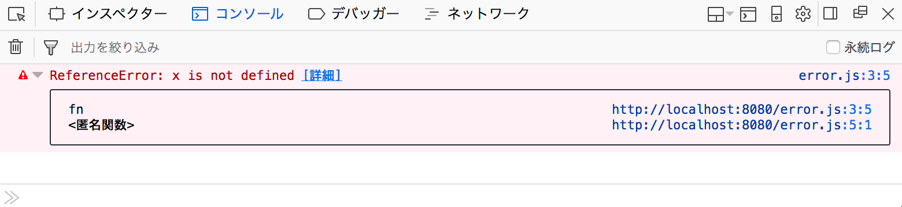

# 例外処理 {#error-handling}

この章ではJavaScriptにおける例外処理について学びます。

## try...catch構文 {#try-catch}

[try...catch][]構文は例外が発生しうるブロックをマークし、例外が発生したときの処理を記述するための構文です。

try...catch構文の`try`ブロック内で例外が発生すると、`try`ブロック内のそれ以降の処理は実行されず、`catch`節に処理が移行します。
`catch`節は、`try`ブロック内で例外が発生すると、発生したエラーオブジェクトとともに呼び出されます。
`finally`節は、`try`ブロック内で例外が発生したかどうかには関係なく、必ず`try`文の最後に実行されます。

次のコードでは、`try`ブロックで例外が発生し、`catch`節の処理が実行され、最後に`finally`節の処理が実行されます。

{{book.console}}
```js
try {
    console.log("try節:この行は実行されます");
    // 未定義の関数を呼び出してReferenceError例外が発生する
    undefinedFunction();
    // 例外が発生したため、この行は実行されません
} catch (error) {
    // 例外が発生したあとはこのブロックが実行される
    console.log("catch節:この行は実行されます");
    console.log(error instanceof ReferenceError); // => true
    console.log(error.message); // => "undefinedFunction is not defined"
} finally {
    // このブロックは例外の発生に関係なく必ず実行される
    console.log("finally節:この行は実行されます");
}
```

また、`catch`節と`finally`節のうち、片方が存在していれば、もう片方の節は省略できます。
`finally`節のみを書いた場合は例外がキャッチされないため、`finally`節を実行後に例外が発生します。

{{book.console}}
<!-- doctest: ReferenceError -->
```js
// catch節のみ
try {
    undefinedFunction();
} catch (error) {
    console.error(error);
}
// finally節のみ
try {
    undefinedFunction();
} finally {
    console.log("この行は実行されます");
}
// finally節のみでは例外がキャッチされないため、この行は実行されません
```

## throw文 {#throw}

[throw][]文を使うとユーザーが例外を投げることができます。
例外として投げられたオブジェクトは、`catch`節で関数の引数のようにアクセスできます。
`catch`節でオブジェクトを参照できる識別子を[例外識別子][]と呼びます。

次のコードでは、`catch`節の`error`識別子でキャッチしたエラーオブジェクトを参照しています。

{{book.console}}
```js
try {
    // 例外を投げる
    throw new Error("例外が投げられました");
} catch (error) {
    // catch節のスコープでerrorにアクセスできる
    console.log(error.message); // => "例外が投げられました"
}
```

## エラーオブジェクト {#error-object}

`throw`文ではエラーオブジェクトを例外として投げることができます。
ここでは、`throw`文で例外として投げられるエラーオブジェクトについて見ていきます。

### Error {#error}

`Error`オブジェクトのインスタンスは`Error`を`new`して作成します。
コンストラクタの第一引数には、エラーメッセージとなる文字列を渡します。
渡したエラーメッセージは`Error#message`プロパティに格納されます。

次のコードでは、`assertPositiveNumber`関数でエラーオブジェクトを作成し、例外として`throw`しています。
投げられたオブジェクトは、catch節の例外識別子（`error`）からエラーオブジェクトを取得でき、エラーメッセージが確認できます。

{{book.console}}
```js
// 渡された数値が0以上ではない場合に例外を投げる関数
function assertPositiveNumber(num) {
    if (num < 0) {
        throw new Error(`${num} is not positive.`);
    }
}

try {
    // 0未満の値を渡しているので、関数が例外を投げる
    assertPositiveNumber(-1);
} catch (error) {
    console.log(error instanceof Error); // => true
    console.log(error.message); // => "-1 is not positive."
}
```

`throw`文はあらゆるオブジェクトを例外として投げられますが、基本的に`Error`オブジェクトのインスタンスを投げることを推奨します。
その理由は後述する**スタックトレース**のためです。
`Error`オブジェクトはインスタンスの作成時に、そのインスタンスが作成されたファイル名や行数などのデバッグに役立つ情報を持っています。
文字列のような`Error`オブジェクトではないオブジェクトを投げてしまうと、スタックトレースが得られません。

そのため、次のように`throw`文で`Error`オブジェクトではないものを投げるのは非推奨です。

{{book.console}}
```js
// 文字列を例外として投げるアンチパターンの例
try {
    throw "例外が投げられました";
} catch (error) {
    // catch節の例外識別子は、投げられた値を参照する
    console.log(error); // => "例外が投げられました"
}
```

### ビルトインエラー {#built-in-error}

エラーには状況に合わせたいくつかの種類があり、これらはビルトインエラーとして定義されています。
ビルトインエラーとは、ECMAScript仕様や実行環境に組み込みで定義されているエラーオブジェクトです。
ビルトインエラーとして投げられるエラーオブジェクトは、すべて`Error`オブジェクトを継承したオブジェクトのインスタンスです。
そのため、ユーザーが定義したエラーと同じように例外処理できます。

ビルトインエラーにはいくつか種類がありますが、ここでは代表的なものを紹介します。

#### ReferenceError {#reference-error}
[ReferenceError][]は存在しない変数や関数などの識別子が参照された場合のエラーです。
次のコードでは、存在しない変数を参照しているため`ReferenceError`例外が投げられます。

{{book.console}}
```js
try {
    // 存在しない変数を参照する
    console.log(x);
} catch (error) {
    console.log(error instanceof ReferenceError); // => true
    console.log(error.name); // => "ReferenceError"
    console.log(error.message); // エラーメッセージが表示される
}
```

#### SyntaxError {#syntax-error}

[SyntaxError][]は構文的に不正なコードを解釈しようとした場合のエラーです。
基本的に`SyntaxError`例外は、JavaScriptを実行する前のパース段階で発生します。
そのため、実行前に発生する例外である`SyntaxError`を`try...catch`文ではcatchできません。

```
// JavaScriptとして正しくない構文をパースするとSyntaxErrorが発生する
foo! bar!
```

次のコードでは、`eval`関数を使って実行時に`SyntaxError`を発生させています。
`eval`関数は渡した文字列をJavaScriptとして実行する関数です。
実行時に発生した`SyntaxError`は、`try...catch`文でもcatchできます。

{{book.console}}
```js
try {
    // eval関数は渡した文字列をJavaScriptとして実行する関数
    // 正しくない構文をパースさせ、SyntaxErrorを実行時に発生させる
    eval("foo! bar!");
} catch (error) {
    console.log(error instanceof SyntaxError); // => true
    console.log(error.name); // => "SyntaxError"
    console.log(error.message); // エラーメッセージが表示される
}
```

#### TypeError {#type-error}

[TypeError][]は値が期待される型ではない場合のエラーです。
次のコードでは、関数ではないオブジェクトを関数呼び出ししているため、`TypeError`例外が投げられます。

{{book.console}}
```js
try {
    // 関数ではないオブジェクトを関数として呼び出す
    const fn = {};
    fn();
} catch (error) {
    console.log(error instanceof TypeError); // => true
    console.log(error.name); // => "TypeError"
    console.log(error.message); // エラーメッセージが表示される
}
```

### ビルトインエラーを投げる {#throw-built-in-error}

ビルトインエラーのインスタンスを作成し、そのインスタンスを例外として投げることもできます。
通常の`Error`オブジェクトと同じように、それぞれのビルトインエラーオブジェクトを`new`してインスタンスを作成できます。

たとえば関数の引数を文字列に限定したい場合は、次のように`TypeError`例外を投げるとよいでしょう。
メッセージを確認しなくても、エラーの名前だけで型に関する例外だとすぐにわかります。

{{book.console}}
```js
// 文字列を反転する関数
function reverseString(str) {
    if (typeof str !== "string") {
        throw new TypeError(`${str} is not a string`);
    }
    return Array.from(str).reverse().join("");
}

try {
    // 数値を渡す
    reverseString(100);
} catch (error) {
    console.log(error instanceof TypeError); // => true
    console.log(error.name); // => "TypeError"
    console.log(error.message); // "100 is not a string"
}
```

## エラーとデバッグ {#error-and-debug}

JavaScript開発においてデバッグ中に発生したエラーを理解することは非常に重要です。
エラーが持つ情報を活用することで、ソースコードのどこでどのような例外が投げられたのかを知ることができます。

エラーはすべて`Error`オブジェクトを拡張したオブジェクトで宣言されています。
つまり、エラーの名前を表す`name`プロパティと内容を表す`message`プロパティを持っています。
この2つのプロパティを確認することで、多くの場面で開発の助けとなるでしょう。

次のコードでは、`try...catch`文で囲っていない部分で例外が発生しています。

[import, error.js](src/error.js)

このスクリプトを読み込むと、投げられた例外についてのログがコンソールに出力されます。
ここではFirefoxにおける実行例を示します。



このエラーログには次の情報が含まれています。

| メッセージ | 意味 |
| -- | -- |
| `ReferenceError: x is not defined` | エラーの種類は`ReferenceError`で、`x`が未定義であること。 |
| `error.js:3:5` | 例外が`error.js`の3行目5列目で発生したこと。つまり`x++;`であること。 |

また、メッセージの後には例外のスタックトレースが表示されています。
スタックトレースとは、プログラムの実行過程を記録した内容で、どの処理によってエラーが発生したかが書かれています。

- スタックトレースの最初の行が実際に例外が発生した場所です。つまり、3行目の `x++;` で例外が発生しています
- 次の行には、そのコードの呼び出し元が記録されています。つまり、3行目のコードを実行したのは5行目の`fn`関数の呼び出しです

このように、スタックトレースは上から下へ呼び出し元をたどれるように記録されています。

コンソールに表示されるエラーログには多くの情報が含まれています。
MDNの[JavaScriptエラーリファレンス][]には、ブラウザが投げるビルトインエラーの種類とメッセージが網羅されています。
開発中にビルトインエラーが発生したときには、リファレンスを見て解決方法を探すとよいでしょう。

## `console.error`とスタックトレース {#console.error}

`console.error`メソッドではメッセージと合わせてスタックトレースをコンソールへ出力できます。

次のコードを実行して、`console.log`と`console.error`の出力結果を見比べてみます。

[import, console/index.js](src/console/index.js)

このコードをFirefoxで実行するとコンソール出力は次の図のようになります。


`console.log`はメッセージだけなのに対して、`console.error`ではメッセージと共にスタックトレースが出力されます。
そのため、エラーが発生した場合のコンソールへのメッセージ出力に`console.error`を利用することでデバッグがしやすくなります。

また、ほとんどのブラウザには`console.log`や`console.error`の出力をフィルターリングできる機能が備わっています。
ただのログ出力には`console.log`を使い、エラーに関するログ出力には`console.error`と使うことで、ログの重要度が区別しやすくなります。

## まとめ {#conclusion}

この章では、例外処理とエラーオブジェクトについて学びました。

- `try...catch`構文は`try`ブロック内で発生した例外を処理できる
- `catch`節と`finally`節は、両方またはどちらか片方を記述する
- `throw`文は例外を投げることができ、`Error`オブジェクトを例外として投げる
- `Error`オブジェクトには、ECMAScript仕様や実行環境で定義されたビルトインエラーがある
- `Error`オブジェクトには、スタックトレースが記録され、デバッグに役立てられる

[try...catch]: https://developer.mozilla.org/ja/docs/Web/JavaScript/Reference/Statements/try...catch
[throw]: https://developer.mozilla.org/ja/docs/Web/JavaScript/Reference/Statements/throw
[例外識別子]: https://developer.mozilla.org/ja/docs/Web/JavaScript/Reference/Statements/try...catch#The_exception_identifier
[Error]: https://developer.mozilla.org/ja/docs/Web/JavaScript/Reference/Global_Objects/Error
[SyntaxError]: https://developer.mozilla.org/ja/docs/Web/JavaScript/Reference/Global_Objects/SyntaxError
[ReferenceError]: https://developer.mozilla.org/ja/docs/Web/JavaScript/Reference/Global_Objects/ReferenceError
[TypeError]: https://developer.mozilla.org/ja/docs/Web/JavaScript/Reference/Global_Objects/TypeError
[JavaScriptエラーリファレンス]: https://developer.mozilla.org/ja/docs/Web/JavaScript/Reference/Errors
