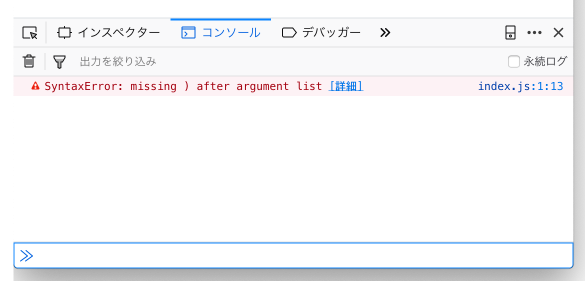

# 値の評価と表示 {#read-eval-print}

変数宣言を使うことで値に名前をつける方法を学びました。
次はその値をどのように評価するかについてです。

値の評価とは、入力した値を評価してその結果を返すことを示しています。
たとえば、次のような値の評価があります。

- `1 + 1` という式を評価したら `2` という結果を返す
- `bookTitle` という変数を評価したら、変数に代入されている値を返す
- `const x = 1;`という文を評価することで変数を定義するが、この文には返り値はありません

この値の評価方法を確認するために、ウェブブラウザ（以下ブラウザ）を使ってJavaScriptを実行する方法を見ていきます。

## この書籍で利用するブラウザ {#recommended-browser}

まずはブラウザ上でJavaScriptのコードを実行してみましょう。
この書籍ではブラウザとして[Firefox][]を利用します。
次のURLからFirefoxをダウンロードし、インストールしてください。

- Firefox: <https://www.mozilla.org/ja/firefox/>

この書籍で紹介するサンプルコードのほとんどは、Google Chrome、Microsoft Edge、Safariなどのブラウザの最新版でも動作します。
一方で、古いJavaScriptしかサポートしていないInternet Explorerでは多くのコードは動作しません。

また、ブラウザによっては標準化されていないエラーメッセージの細かな違いや開発者ツールの使い方の違いなどもあります。
この書籍ではFirefoxで実行した結果を記載しています。
そのため、Firefox以外のブラウザでは細かな違いがあることに注意してください。

## ブラウザでJavaScriptを実行する {#execute-js-on-browser}

ブラウザでJavaScriptを実行する方法としては大きく分けて2つあります。
1つ目はブラウザの開発者ツールのコンソール上でJavaScriptコードを評価する方法です。
2つ目はHTMLファイルを作成しJavaScriptコードを読み込む方法です。

### ブラウザの開発者ツールのコンソール上でJavaScriptコードを評価する方法 {#repl-on-browser}

ブラウザやNode.jsなど多くの実行環境には、コードを評価してその結果を表示するREPL（read–eval–print loop）と呼ばれる開発者向けの機能があります。
Firefoxでは、開発者ツールの**Webコンソール**と呼ばれるパネルにREPL機能が含まれています。
REPL機能を使うことで、試したいコードをその場で実行できるため、JavaScriptの動作を理解するのに役立ちます。

REPL機能を使うには、まずFirefoxの開発者ツールを次のいずれかの方法で開きます。

- Firefox メニュー（メニューバーがある場合や macOS では、ツールメニュー）の Web 開発サブメニューで "Web コンソール" を選択する
- キーボードショートカット Ctrl+Shift+K（macOS では Command+Option+K）を押下する

詳細は"[Webコンソールを開く][]"を参照してください。


開発者ツールの"コンソール"タブを選択すると、コマンドライン（二重山カッコ`»`からはじまる欄）に任意のコードを入力し評価できます。
このコマンドラインがブラウザにおけるREPL機能です。

REPLに`1`という値を入力すると、その評価結果である`1`が次の行に表示されます。

```
» 1
1
```

`1 + 1` という式を入力すると、その評価結果である`2`が次の行に表示されます。

```
» 1 + 1
2
```

次に`const`キーワードを使って`bookTitle`という変数を宣言してみると、`undefined`という結果が次の行に表示されます。
変数宣言は変数名と値を関連づけるだけであるため、変数宣言自体は何も値を返さないという意味で`undefined`が結果になります。
REPLではそのまま次の入力ができるため、`bookTitle`という入力をすると、先ほど変数に入れた`"JavaScript Primer"`という結果が次の行に表示されます。

```
» const bookTitle = "JavaScript Primer";
undefined
» bookTitle
"JavaScript Primer"
```

このようにコマンドラインのREPL機能では、JavaScriptのコードを1行ごとに実行できます。
Shift + Enterで改行して複数行の入力もできます。
好きな単位でJavaScriptのコードを評価できるため、コードの動きを簡単に試したい場合などに利用できます。

注意点としては、REPLではそのREPLを終了するまで`const`キーワードなどで宣言した変数が残り続けます。
たとえば、`const`での変数宣言は同じ変数名を二度定義できないというルールでした。
そのため1行ずつ実行しても、同じ変数名を定義したことになるため構文エラー（`SyntaxError`）となります。

```
» const bookTitle = "JavaScript Primer";
undefined
» const bookTitle = "JavaScript Primer";
SyntaxError: redeclaration of const bookTitle
```

ブラウザでは、開発者ツールを開いているウェブページでリロードするとREPLの実行状態もリセットされます。
`redeclaration`（再定義）に関するエラーメッセージが出た際にはページをリロードしてみてください。

### HTMLファイルを作成しJavaScriptコードを読み込む方法 {#js-in-html}

REPLはあくまで開発者向けの機能です。
ウェブサイトではHTMLに記述した`<script>`タグでJavaScriptを読み込み実行します。
ここでは、HTMLとJavaScriptファイルを使ったJavaScriptコードの実行方法を見ていきます。

HTMLファイルとJavaScriptファイルの2種類を使い、JavaScriptのコードを実行する準備をしていきます。
ファイルを作成するため[Atom][]や[Visual Studio Code][]などのJavaScriptに対応したエディターを用意しておくとスムーズです。
エディターはどんなものでも問題ありませんが、必ず文字コード（エンコーディング）は**UTF-8**、改行コードは**LF**にしてファイルを保存してください。

ファイルを作成するディレクトリはどんな場所でも問題ありませんが、ここでは`example`という名前のディレクトリにファイルを作成していきます。

まずはJavaScriptファイルとして`index.js`ファイルを`example/index.js`というパスに作成します。
`index.js`の中には次のようなコードを書いておきます。

[import, title:"index.js"](src/example/index1.js)

次にHTMLファイルとして`index.html`ファイルを`example/index.html`というパスに作成します。
このHTMLファイルから先ほど作成した`index.js`ファイルを読み込み実行します。
`index.html`の中には次のようなコードを書いておきます。

[include, title:"index.html"](src/example/index.html)

重要なのは`<script src="./index.js"></script>`という記述です。
これは同じディレクトリにある`index.js`という名前のJavaScriptファイルをスクリプトとして読み込むという意味になります。

最後にブラウザで作成した`index.html`を開きます。
HTMLファイルを開くには、ブラウザにHTMLファイルをドラッグアンドドロップするかまたはファイルメニューから"ファイルを開く"でHTMLファイルを選択します。
HTMLファイルを開いた際に、ブラウザのアドレスバーには`file:///`からはじまるローカルファイルのファイルパスが表示されます。

先ほどと同じ手順で"Web コンソール"を開いてみると、コンソールには何も表示されていないはずです。
REPLでは自動で評価結果のコンソール表示まで行いますが、JavaScriptコードとして読み込んだ場合は勝手に評価結果を表示することはありません。
あくまで自動表示はREPLの機能です。そのため多くの実行環境では**コンソール表示**するためのAPI（機能）が存在しています。

## Console API {#console-api}

JavaScriptの多くの実行環境では、Console APIを使って**コンソールに表示**します。
`console.log(引数)`の引数にコンソール表示したい値を渡すことで、評価結果がコンソールに表示されます。

先ほどの`index.js`の中身を次のように書き換えます。
そしてページをリロードすると、 `1` という値を評価した結果がWebコンソールに表示されます。

{{book.console}}
[import, title:"index.js"](./src/console-example.js)

次のように引数に式を書いた場合は先に引数（`(`と`)`の間に書かれたもの）の式を評価してから、その結果をコンソールに表示します。
そのため、`1 + 1` の評価結果として `2` がコンソールに表示されます。

{{book.console}}
[import, title:"index.js"](./src/console-expression-example.js)

同じように引数に変数を渡すこともできます。
この場合もまず先に引数である変数を評価してから、その結果をコンソールに表示します。

{{book.console}}
[import, title:"index.js"](./src/console-variable-example.js)

Console APIは原始的なプリントデバッグとして利用できます。
「この値は何だろう」と思ったらコンソールに表示すると解決する問題は多いです。
またJavaScriptの開発環境は高機能化が進んでいるため、Console API以外にもさまざまな機能がありますがここでは詳細は省きます。

この書籍では、コード内で評価結果を表示するためにConsole APIを利用していきます。

すでに何度も登場していますが、コード内のコメントで`// => 評価結果`と書いている場合があります。
このコメントは、その左辺にある値を評価した結果またはConsole APIで表示した結果を掲載しています。

{{book.console}}
```js
// 式の評価結果の例（コンソールには表示されない）
1; // => 1
const total = 42 + 42;
// 変数の評価結果の例（コンソールには表示されない）
total; // => 84
// Console APIでコンソールに表示する例
console.log("JavaScript"); // => "JavaScript"
```

## ウェブ版の書籍でコードを実行する {#execute-on-web}

<!-- TODO: Web版のみ表示する -->

ウェブ版の書籍では実行できるサンプルコードには**実行**というボタンが配置されています。
このボタンでは実行するたびに毎回新しい環境を作成して実行するため、REPLで発生する変数の再定義といった問題はおきません。

一方で、REPLと同じように`1`というコードを実行すると`1`という評価結果を得られます。
またConsole APIにも対応しています。サンプルコードを改変して実行するなど、よりコードへの理解を深めるために利用できます。

{{book.console}}
```js
console.log("Console APIで表示");
// 値を評価した場合は最後の結果が表示される
42; // => 42
```

## コードの評価とエラー {#eval-code-and-error}

JavaScriptのコードを実行したときにエラーメッセージが表示されて意図したように動かなかった場合もあるはずです。
プログラムを書くときに一度もエラーを出さずに書き終えることはほとんどありません。
特に新しいプログラミング言語を学ぶ際にはトライアンドエラー（試行錯誤）することはとても重要です。

エラーメッセージがWebコンソールに表示された際には、あわてずにそのエラーメッセージを読むことで多くの問題は解決できます。
またエラーには多く分けて構文エラーと実行時エラーの2種類があります。
ここではエラーメッセージの簡単な読み方を知り、そのエラーを修正する足がかりを見ていきます。

### 構文エラー {#syntax-error}

構文エラーは書かれたコードの文法が間違っている場合に発生するエラーです。

JavaScriptエンジンは、コードをパース（解釈）してから、プログラムとして実行できる形に変換して実行します。
コードをパースする際に文法の問題が見つかると、その時点で構文エラーが発生するためプログラムとして実行できません。

次のコードでは、関数呼び出しに`)`をつけ忘れているため構文エラーが発生します。

{{book.console}}
<!-- doctest:Error -->
[include, title:"index.js"](src/invalid/syntax-error/index.js)



Firefoxでこのコードを実行すると次のようなエラーメッセージがコンソールに表示されます。

> SyntaxError: missing ) after argument list[詳細] index.js:1:13 

エラーメッセージはブラウザによって多少の違いはありますが、基本的には同じ形式のメッセージになります。
このエラーメッセージをパーツごとに見てみると次のようになります。

```
SyntaxError: missing ) after argument list[詳細] index.js:1:13 
^^^^^^^^^^^  ^^^^^^^^^^^^^^^^^^^^^^^^^^^^^      ^^^^^^^^　^^^^
エラーの種類                |                        | 　行番号:列番号
                  エラー内容の説明                 ファイル名
```

| メッセージ | 意味 |
| -- | -- |
| `SyntaxError: missing ) after argument list` | エラーの種類は`SyntaxError`で、関数呼び出しの`)`が足りないこと |
| `index.js:1:13 ` | 例外が`index.js`の1行目13列目で発生したこと |

Firefoxでは**[詳細]**というリンクがエラーメッセージによっては表示されます。
この**[詳細]**リンクはエラーメッセージに関するMDNの解説ページへのリンクとなっています。
この例のエラーメッセージでは次の解説ページへリンクされています。

- <https://developer.mozilla.org/ja/docs/Web/JavaScript/Reference/Errors/Missing_parenthesis_after_argument_list>

このエラーメッセージや解説ページから、関数呼び出しの`)`が足りないため構文エラーとなっていることがわかります。
そのため、次のように足りない`)`を追加することでエラーを修正できます。

{{book.console}}
```js
console.log(1);
```

構文エラーによっては少しエラーメッセージから意味が読み取りにくいものもあります。

次のコードでは、`const`を`cosnt`とタイプミスしているため構文エラーが発生しています。

{{book.console}}
<!-- doctest:Error -->
[include, title:"index.js"](./src/invalid/syntax-error-typo/index.js)

> SyntaxError: unexpected token: identifier[詳細] index.js:1:6 

| メッセージ | 意味 |
| -- | -- |
| `SyntaxError: unexpected token: identifier` | エラーの種類は`SyntaxError`で、予期しないものが識別子（変数名）に指定されている |
| `index.js:1:6` | 例外が`index.js`の1行目6列目で発生したこと |

プログラムをパースする際に`index.js:1:6`で予期しない（構文として解釈できない）識別子が見つかったため、構文エラーが発生したという意味になります。
1行目6列目（行は1から、列は0からカウントする）である`a`という文字列がおかしいということになります。
しかし、実際には`cosnt`というタイプミスがこの構文エラーの原因です。

なぜこのようなエラーメッセージになるかというと、`cosnt`（`const`のタイプミス）はキーワードではないため、ただの変数名として解釈されます。
そのため、このコードは次のようなコードであると解釈され、そのような文法は認められないということで構文エラーとなっています。

<!-- doctest:Error -->
[include, reference-error.js](src/invalid/reference-error.js)

このようにエラーメッセージとエラーの原因は必ずしも一致しません。
しかし、構文エラーの原因はコードの書き間違いであることがほとんどです。
そのため、エラーが発生した位置やその周辺を注意深く見ることで、エラーの原因を特定できます。

### 実行時エラー {#runtime-error}

実行時エラーはプログラムを実行している最中に発生するエラーです。
実行時（ランタイム）におきるエラーであるため、ランタイムエラーと呼ばれることもあります。
APIに渡す値の問題から起きる`TypeError`や存在しない変数を参照しようとして起きる`ReferenceError`などさまざまな種類があります。

実行時エラーが発生した場合は、そのコードは構文としては正しい（構文エラーではない）のですが、別のことが原因でエラーが発生しています。

次のコードでは`x`という存在しない変数を参照したため、`ReferenceError`という実行時エラーが発生しています。

{{book.console}}
<!-- doctest:Error -->
[include, title:"index.js"](./src/runtime-error/index.js)

> ReferenceError: x is not defined[詳細]  index.js:2:1

| メッセージ | 意味 |
| -- | -- |
| `ReferenceError: x is not defined` | エラーの種類は`ReferenceError`で、`x`という未定義の識別子を参照したため発生 |
| `index.js:2:1` | 例外が`index.js`の2行目1列目で発生したこと |

`x`という変数や関数が存在するかは、実行してみないとわかりません。
そのため、実行して`x`という識別子を参照したときに、初めて`x`が存在するかが判明し、`x`が存在しない場合は`ReferenceError`となります。

この例では、`value`変数を参照しているつもりで、`x`という存在しない変数を参照していたのが原因のようです。
先ほどのコードは、次のように参照する変数を`value`に変更すれば、エラーが修正できます。

{{book.console}}
```js
const value = "値";
console.log(value); // => "値"
```

このように、実行時エラーは該当する箇所を実行するまで、エラーになるかがわからない場合も多いのです。
そのため、どこまではちゃんと実行できたか順番に追っていくような、エラーの原因を特定する作業が必要になる場合があります。
このようなエラーの原因を特定し、修正する作業のことを**デバッグ**と呼びます。

実行時エラーは構文エラーに比べてエラーの種類も多く、その原因もプログラムの数だけあります。
そのため、エラーの原因を見つけることが大変な場合もあります。
しかし、JavaScriptはとてもよく使われている言語なので、ウェブ上には類似するエラーを報告している人も多いです。
エラーメッセージで検索をしてみると、類似するエラーの原因と解消方法が見つかるケースもあります。

実行時エラーが発生した際には、発生したエラーの行数の周辺をよく見ることやエラーメッセージを調べてみることが大切です。

## まとめ {#conclusion}

ブラウザ上でJavaScriptを実行する方法として開発者ツールを使う方法とHTMLからJavaScriptファイルを読み込む方法を紹介しました。
「第一部 基本文法」で紹介するサンプルコードは基本的にこれらの方法で実行できます。
サンプルコードを自分なりに改変して実行してみるとより理解が深くなるため、サンプルコードの動作を自分自身で確認してみてください。

コードを実行してエラーが発生した場合にはエラーメッセージや位置情報などが表示されます。
これらのエラー情報を使ってデバッグすることでエラーの原因を取り除けるはずです。

JavaScriptにおいては多くのエラーはすでに類似するケースがウェブ上に報告されています。
構文エラーや実行時エラーの典型的なものはMDNの[JavaScript エラーリファレンス][]にまとめられています。
また[Google][]、[GitHub][]、[Stack Overflow][]などでエラーメッセージを検索することで、エラーの原因を見つけられることもあります。

エラーがWebコンソールに表示されているならば、そのエラーは修正できます。
エラーを過度に怖がる必要はありません。エラーメッセージなどのヒントを使ってエラーを修正していけるようにしましょう。

[Firefox]: https://www.mozilla.org/ja/firefox/
[Webコンソールを開く]: https://developer.mozilla.org/ja/docs/Tools/Web_Console/Opening_the_Web_Console
[Atom]: https://atom.io/
[Visual Studio Code]: https://code.visualstudio.com/
[Google]: https://www.google.com/
[Stack Overflow]: https://stackoverflow.com/
[GitHub]: https://github.com/
[JavaScript エラーリファレンス]: https://developer.mozilla.org/ja/docs/Web/JavaScript/Reference/Errors
