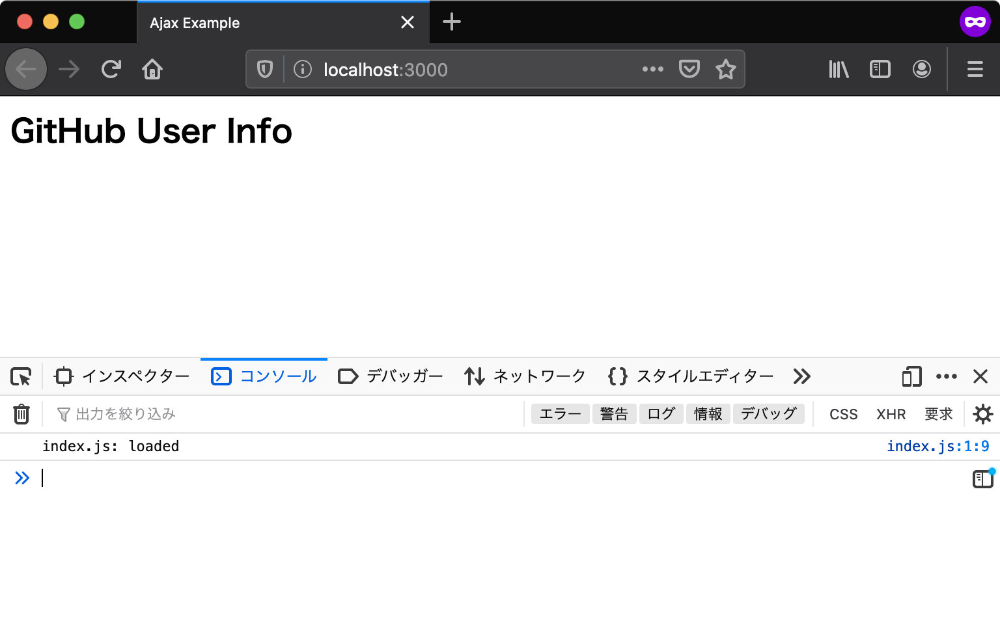

# エントリーポイント {#entrypoint}

エントリーポイントとは、アプリケーションの中で一番最初に呼び出される部分のことです。
アプリケーションを作成するにあたり、まずはエントリーポイントを用意しなければなりません。

Webアプリケーションにおいては、常にHTMLドキュメントがエントリーポイントとなります。
ウェブブラウザによりHTMLドキュメントが読み込まれたあとに、HTMLドキュメント中で読み込まれたJavaScriptが実行されます。

## プロジェクトディレクトリを作成 {#create-project-directory}

今回作成するアプリにはHTMLやJavaScriptなど複数のファイルが必要となります。
そのため、まずそれらのファイルを置くためのディレクトリを作成します。

ここでは `ajaxapp` という名前で新しいディレクトリを作成します。ここからは作成した`ajaxapp`ディレクトリ以下で作業していきます。

またこのプロジェクトで作成するファイルは、必ず文字コード（エンコーディング）を**UTF-8**、改行コードを**LF**にしてファイルを保存します。


## HTMLファイルの用意 {#preparing-html}

エントリーポイントとして、まずは最低限の要素だけを配置したHTMLファイルを`index.html`というファイル名で作成しましょう。
`body`要素の一番下で読み込んでいる`index.js`が、今回のアプリケーションの処理を記述するJavaScriptファイルです。

[import, title:"index.html"](src/index.html)

次に同じディレクトリに`index.js`というファイルを作成します。
`index.js`にはスクリプトが正しく読み込まれたことを確認できるよう、コンソールにログを出力する処理だけを書いておきます。

[import, title:"index.js"](src/index.js)

ここでの`ajaxapp`ディレクトリのファイル配置は次のようになっていれば問題ありません。

```
ajaxapp
├── index.html
└── index.js
```

次はこの`index.html`をブラウザで表示して、コンソールにログが出力されることを確認していきます。

## ローカルサーバーでHTMLを確認する {#local-server}

ウェブブラウザで`index.html`を開く前に、開発用のローカルサーバーを準備します。 
ローカルサーバーを立ち上げずに直接HTMLファイルを開くこともできますが、その場合は`file:///`からはじまるURLになります。
`file`スキーマでは[Same Origin Policy][]のセキュリティ制限により、多くの場面でアプリケーションは正しく動作しません。
本章はローカルサーバーを立ち上げた上で、`http`スキーマのURLでアクセスすることを前提としています。

コマンドラインで`ajaxapp`ディレクトリへ移動し、次のコマンドでローカルサーバーを起動します。 
次のコマンドでは、この書籍用に作成された`@js-primer/local-server`というローカルサーバーモジュールをダウンロードと同時に実行します。
まだ`npx`コマンドの用意ができていなければ、先に「[アプリケーション開発の準備][]」の章を参照してください。

```shell-session
$ npx @js-primer/local-server
```
 
起動したローカルサーバーのURL（`http://localhost:3000`）へブラウザでアクセスすると、`"index.js: loaded"`とコンソールにログが出力されます。
Console APIで出力したログを確認するには、ウェブブラウザの開発者ツールを開く必要があります。
ほとんどのブラウザで開発者ツールが同梱されていますが、本章ではFirefoxを使って確認します。
Firefoxの開発者ツールは次のいずれかの方法で開きます。

- Firefox メニュー（メニューバーがある場合や macOS では、ツールメニュー）の Web 開発サブメニューで "Web コンソール" を選択する
- キーボードショートカット Ctrl+Shift+K（macOS では Command+Option+K）を押下する

詳細は"[Webコンソールを開く][]"を参照してください。



## ウェブブラウザとDOM {#web-browsers-and-dom}

HTMLドキュメントをブラウザで読み込むとき、[DOM][]と呼ばれるプログラミング用のデータ表現が生成されます。
**DOM（Document Object Model）** とは、HTMLドキュメントのコンテンツと構造をJavaScriptから操作できるオブジェクトです。
DOMではHTMLドキュメントのタグの入れ子関係を木構造で表現するため、DOMが表現するHTMLタグの木構造を **DOMツリー** と呼びます。

たとえば、DOMにはHTMLドキュメントそのものを表現する `document` グローバルオブジェクトがあります。
`document` グローバルオブジェクトには、指定したHTML要素を取得したり、新しくHTML要素を作成するメソッドが実装されています。
`document` グローバルオブジェクトを使うことで、先ほどの`index.html` に書かれたHTMLをJavaScriptから操作できます。

<!-- DOMがないため -->
<!-- doctest:disable -->
```js
// CSSセレクタを使ってDOMツリー中のh2要素を取得する
const heading = document.querySelector("h2");
// h2要素に含まれるテキストコンテンツを取得する
const headingText = heading.textContent;

// button要素を作成する
const button = document.createElement("button");
button.textContent = "Push Me";
// body要素の子要素としてbuttonを挿入する
document.body.appendChild(button);
```

JavaScriptとDOMはWebアプリケーション開発において切っても切り離せない関係です。
動的なWebアプリケーションを作るためには、JavaScriptによるDOMの操作が不可欠です。
今回のユースケースでもGitHubのAPIから取得したデータを元に、動的にDOMツリーを操作して画面の表示を更新します。

しかし、DOMは言語機能（ECMAScript）ではなくブラウザが実装しているAPIです。
そのため、DOMを持たないNode.jsなどの実行環境では使えず、`document`のようなグローバルオブジェクトも存在しないことには注意が必要です。

## このセクションのチェックリスト {#section-checklist}

このセクションでは、エントリーポイントとなるHTMLを作成し、JavaScriptモジュールのエントリーポイントとなるJavaScriptファイルを読み込むところまでを実装しました。

- `ajaxapp`という名前のプロジェクトディレクトリを作成した
- エントリーポイントとなる`index.html`を作成した
- JavaScriptのエントリーポイントとなる`index.js`を作成し`index.html`から読み込んだ
- ローカルサーバーを使ってブラウザで`index.html`を表示した
- `index.js`からコンソールに出力されたログを確認した
- JavaScriptからHTMLドキュメントを操作するDOMについて学んだ

[Same Origin Policy]: https://developer.mozilla.org/ja/docs/Web/Security/Same-origin_policy 
[アプリケーション開発の準備]: ../../setup-local-env/README.md
[Webコンソールを開く]: https://developer.mozilla.org/ja/docs/Tools/Web_Console/Opening_the_Web_Console
[DOM]: https://developer.mozilla.org/ja/docs/Web/API/Document_Object_Model/Introduction
