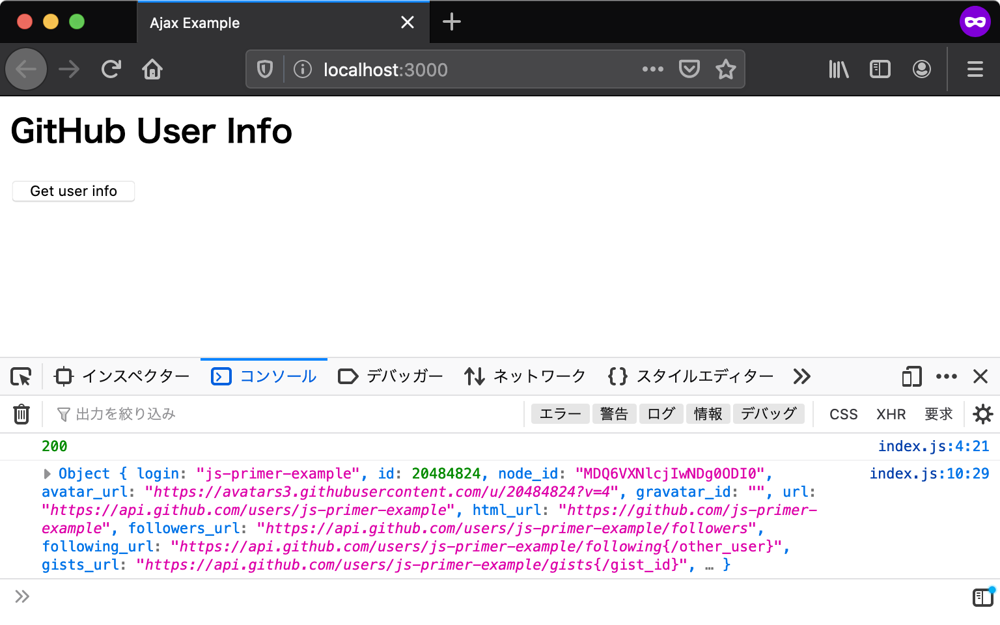
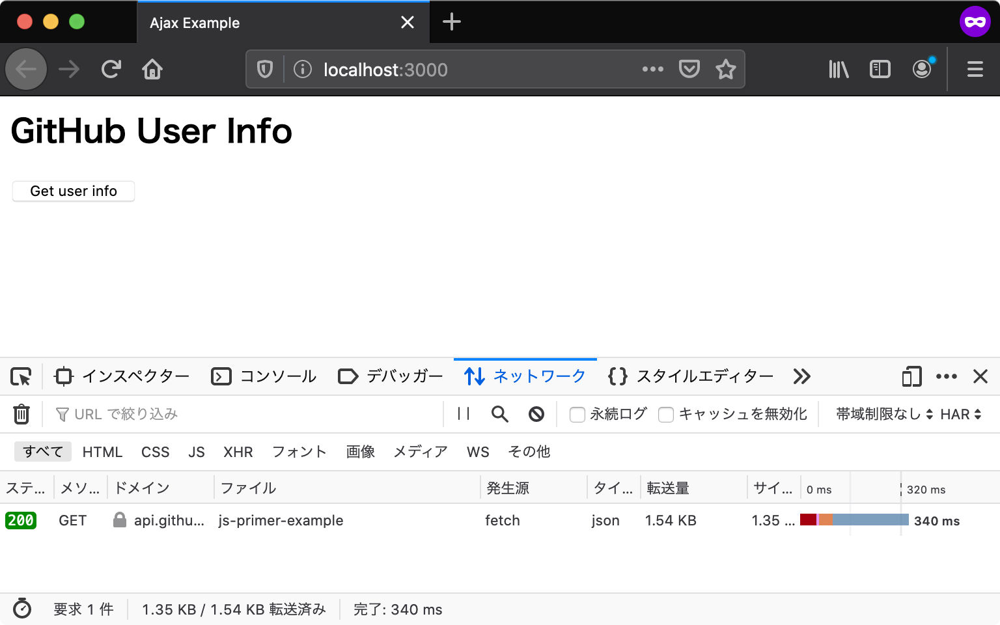

# HTTP通信 {#http-communication}

ローカルサーバーでアプリケーションが実行できるようになったので、次はGitHubのAPIを呼び出す処理を実装していきます。
GitHubのAPIを呼び出すためにはHTTP通信をする必要があります。
ウェブブラウザ上でJavaScriptからHTTP通信するために、[Fetch API][]という機能を使います。

## Fetch API {#fetch-api}

**Fetch API**はHTTP通信を行ってリソースを取得するためのAPIです。
Fetch APIを使うことで、ページ全体を再読み込みすることなく指定したURLからデータを取得できます。
Fetch APIは同じくHTTP通信を扱う[XMLHttpRequest][]と似たAPIですが、より強力で柔軟な操作が可能です。

リクエストを送信するためには、`fetch`メソッドを利用します。
`fetch`メソッドにURLを与えることで、HTTPリクエストが作成され、サーバーとのHTTP通信を開始します。

GitHubにはユーザー情報を取得するAPIとして、`https://api.github.com/users/GitHubユーザーID`というURLが用意されています。
GitHubのユーザーIDには、英数字と`-`（ハイフン）以外は利用できないため、ユーザーIDは`encodeURIComponent`関数を使ってエスケープしたものを結合します。`encodeURIComponent`は`/`や`%`などURLとして特殊な意味を持つ文字列をただの文字列として扱えるようにエスケープする関数です。

次のコードでは、指定したGitHubユーザーIDの情報を取得するURLに対して`fetch`メソッドで、GETのHTTPリクエストを行っています。

<!-- fetchがないため -->
<!-- doctest:disable -->
```js
const userId = "任意のGitHubユーザーID";
fetch(`https://api.github.com/users/${encodeURIComponent(userId)}`);
```

## レスポンスの受け取り {#receive-response}

GitHubのAPIに対してHTTPリクエストを送信しましたが、まだレスポンスを受け取る処理を書いていません。
次はサーバーから返却されたレスポンスのログをコンソールに出力する処理を実装します。

`fetch`メソッドは`Promise`を返します。この`Promise`インスタンスはリクエストのレスポンスを表す`Response`オブジェクトでresolveされます。
送信したリクエストにレスポンスが返却されると、`then`コールバックが呼び出されます。

次のように、`Response`オブジェクトの`status`プロパティからは、HTTPレスポンスのステータスコードが取得できます。
また、`Response`オブジェクトの`json`メソッドも`Promise`を返します。これは、HTTPレスポンスボディをJSONとしてパースしたオブジェクトでresolveされます。
ここでは、書籍用に用意した`js-primer-example`というGitHubアカウントのユーザー情報を取得しています。

{{book.console}}
<!-- fetchがないため -->
<!-- doctest:disable -->
```js
const userId = "js-primer-example";
fetch(`https://api.github.com/users/${encodeURIComponent(userId)}`)
    .then(response => {
        console.log(response.status); // => 200
        return response.json().then(userInfo => {
            // JSONパースされたオブジェクトが渡される
            console.log(userInfo); // => {...}
        });
    });
```

## エラーハンドリング {#error-handling}

HTTP通信にはエラーがつきものです。
そのためFetch APIを使った通信においても、エラーをハンドリングする必要があります。
たとえば、サーバーとの通信に際してネットワークエラーが発生した場合は、ネットワークエラーを表す`NetworkError`オブジェクトでrejectされた`Promise`が返されます。
すなわち、`then`メソッドの第二引数か`catch`メソッドのコールバック関数が呼び出されます。

{{book.console}}
<!-- fetchがないため -->
<!-- doctest:disable -->
```js
const userId = "js-primer-example";
fetch(`https://api.github.com/users/${encodeURIComponent(userId)}`)
    .then(response => {
        console.log(response.status);
        return response.json().then(userInfo => {
            console.log(userInfo);
        });
    }).catch(error => {
        console.error(error);
    });
```

一方で、リクエストが成功したかどうかは`Response`オブジェクトの`ok`プロパティで認識できます。
`ok`プロパティは、HTTPステータスコードが200番台であれば`true`を返し、それ以外の400や500番台などなら`false`を返します。
次のように、`ok`プロパティが`false`となるエラーレスポンスをハンドリングできます。

<!-- Note: Fetch API デフォルトで自動的にリダイレクトする
そのため、このコード例なら response.status が 30x はこない

```
fetch("https://httpbin.org/status/301");
```

-->

{{book.console}}
<!-- fetchがないため -->
<!-- doctest:disable -->
```js
const userId = "js-primer-example";
fetch(`https://api.github.com/users/${encodeURIComponent(userId)}`)
    .then(response => {
        console.log(response.status); 
        // エラーレスポンスが返されたことを検知する
        if (!response.ok) {
            console.error("エラーレスポンス", response);
        } else {
            return response.json().then(userInfo => {
                console.log(userInfo);
            });
        }
    }).catch(error => {
        console.error(error);
    });
```

ここまでの内容をまとめ、GitHubからユーザー情報を取得する関数を`fetchUserInfo`という名前で定義します。

[import, index.js](src/index.js)

index.jsでは関数を定義しているだけで、呼び出しは行っていません。

ページを読み込むたびにGitHubのAPIを呼び出すと、呼び出し回数の制限を超えるおそれがあります。
呼び出し回数の制限を超えると、APIからのレスポンスがステータスコード403のエラーになってしまいます。

そのため、HTMLドキュメント側に手動で`fetchUserInfo`関数を呼び出すためのボタンを追加します。
ボタンのclickイベントで`fetchUserInfo`関数を呼び出し、取得したいユーザーIDを引数として与えています。
例として`js-primer-example`という書籍用に用意したGitHubアカウントを指定しています。

[import, index.html](src/index.html)

準備ができたら、ローカルサーバーを立ち上げてindex.htmlにアクセスしましょう。
ボタンを押すとHTTP通信が行われ、コンソールにステータスコードとレスポンスのログが出力されます。



また、開発者ツールのネットワークパネルを開くと、GitHubのサーバーに対してHTTP通信が行われていることを確認できます。



## [コラム] XMLHttpRequest {#xhr}

[XMLHttpRequest][]（**XHR**）はFetch APIと同じくHTTP通信を行うためのAPIです。
Fetch APIが標準化される以前は、ブラウザとサーバーの間で通信を行うにはXHRを使うのが一般的でした。
このセクションで扱ったFetch APIによる`fetchUserInfo`関数は、XHRを使うと次のように書けます。

```js
function fetchUserInfo(userId) {
    // リクエストを作成する
    const request = new XMLHttpRequest();
    request.open("GET", `https://api.github.com/users/${encodeURIComponent(userId)}`);
    request.addEventListener("load", () => {
        // リクエストが成功したかを判定する
        // Fetch APIのresponse.okと同等の意味
        if (request.status >= 200 && request.status < 300) {
            // レスポンス文字列をJSONオブジェクトにパースする
            const userInfo = JSON.parse(request.responseText);
            console.log(userInfo);
        } else {
            console.error("エラーレスポンス", request.statusText);
        }
    });
    request.addEventListener("error", () => {
        console.error("ネットワークエラー");
    });
    // リクエストを送信する
    request.send();
}
```

Fetch APIはXHRを置き換えるために作られたもので、多くのユースケースではXHRを使う必要はなくなっています。
ただし、古いブラウザではFetch APIが実装されていないため、ブラウザの互換性を保つためにXHRを使う場面もまだあります。
XHRの詳しい使い方については、[XHRの利用についてのドキュメント][]を参照してください。

## このセクションのチェックリスト {#section-checklist}

- [Fetch API][]を使ってHTTPリクエストを送った
- GitHubのAPIから取得したユーザー情報のJSONオブジェクトをコンソールに出力した
- Fetch APIの呼び出しに対するエラーハンドリングを行った
- `fetchUserInfo`関数を宣言し、ボタンのクリックイベントで呼び出した

[Fetch API]: https://developer.mozilla.org/ja/docs/Web/API/Fetch_API
[XMLHttpRequest]: https://developer.mozilla.org/ja/docs/Web/API/XMLHttpRequest
[XHRの利用についてのドキュメント]: https://developer.mozilla.org/ja/docs/Web/API/XMLHttpRequest/Using_XMLHttpRequest
